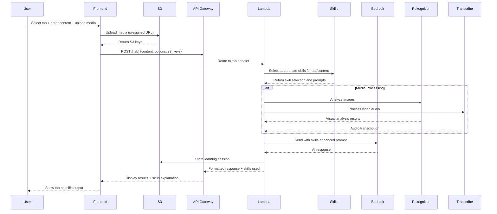

# Design Document: Nebula AI

## Overview

Nebula AI is a comprehensive AI-powered learning, developer productivity, and daily life assistant built on AWS serverless architecture. The system provides multimodal content processing capabilities, supporting text, images, videos, and file uploads through a chat-style interface with voice interaction support. The application leverages Amazon Bedrock for AI processing, Amazon Rekognition for visual analysis, Amazon Transcribe for audio processing, and S3 for unlimited media storage.

The core innovation lies in the intelligent routing system that automatically selects from specialized Bedrock prompt templates based on user-selected modes, providing optimized AI responses for different learning, productivity, and daily life scenarios. Enhanced with multi-step code quality pipeline, entrepreneurship support, data analytics capabilities, strict quiz mode, video editing guidance, persistent project memory, voice input/output, app building guidance, mental wellness support, news explanation, and general daily life assistance.

Key enhancements include:
- **8-Tab Interface**: General Chat (FIRST tab), Explain, Debug, Summarize, Quiz, Cyber Safety, Mental Wellness, Study Focus
- **Voice Interaction**: Browser-based and deep-layer speech-to-text and text-to-speech for hands-free operation
- **App Building Guidance**: Project scaffolds, architecture plans, code generation for web/desktop/mobile apps (no automatic deployment)
- **Mental Wellness Support**: Emotional support with strong safety disclaimers (not medical advice, encourages professional help)
- **News Explanation**: Journalist-style neutral explanations with disclaimers about not being real-time
- **Enhanced File Management**: Up to 10 files per tab with persistent accumulation and file list display
- **Flexible Quiz Generation**: User-selectable question count via input field/slider, presets, or "auto" mode
- **Educational Games**: Flashcards, matching, fill-in-blank, rapid-fire Q&A generated from study materials
- **Expanded Language Support**: C, C++, Java, Python, JavaScript/TypeScript, Go, Rust, PHP, C#, Kotlin, Swift, Ruby, SQL, HTML/CSS, "Other"
- **Multilingual Support**: English, Hindi, and major world languages with best-effort coverage
- **Domain Expertise**: AI/ML, data science, data engineering, data analytics, full-stack web development (MERN, etc.)
- **Programming Learner Mode**: Step-by-step teaching with exercises and progressive challenges
- **Multi-Step Code Quality Pipeline**: Internal self-review for all code outputs with Run & Test sections and assumptions listing
- **Entrepreneurship & Productivity Support**: Business idea analysis, productivity systems guidance, and habit building frameworks
- **Data Analytics & ML Learning**: CSV analysis, ML pipeline explanations, and data visualization guidance
- **Strict Quiz Mode**: Soft proctoring with timing controls and one-question-at-a-time display
- **Video Editing Guidance**: Content creation scripts and editing plans for consumer video editors
- **Project Context & Memory**: Persistent project continuity across sessions to prevent "forgetting" ongoing work

## Architecture

### High-Level Architecture

```mermaid
graph TB
    subgraph "Frontend Layer"
        UI[React/Next.js 8-Tab Interface]
        GeneralChatTab[General Chat Tab - FIRST]
        ExplainTab[Explain Tab]
        DebugTab[Debug Tab] 
        SummarizeTab[Summarize Tab]
        QuizTab[Quiz Tab - Enhanced with Flexible Count & Strict Mode]
        CyberTab[Cyber Safety Tab]
        MentalWellnessTab[Mental Wellness Tab - NEW]
        StudyTab[Study Focus Tab - Enhanced with Games]
        Upload[Drag & Drop Upload]
        MultipartUpload[Multipart Upload Handler]
        ProjectMemory[Project Context Manager]
        StrictQuizUI[Strict Quiz Mode Interface]
        VoiceInput[Voice Input - Speech-to-Text]
        VoiceOutput[Voice Output - Text-to-Speech]
        FileListManager[File List Display - Up to 10 Files]
        QuizCustomizer[Quiz Question Count Selector]
        EducationalGames[Educational Games Interface]
    end
    
    subgraph "AWS API Layer"
        Gateway[API Gateway]
        Auth[Optional Auth]
    end
    
    subgraph "AWS Compute Layer"
        Lambda[Lambda Router Function]
        Bedrock[Amazon Bedrock LLM]
        Skills[Skills.sh Integration]
        TextExtractor[Text Extraction Service]
        CodeQualityPipeline[Multi-Step Code Quality Pipeline]
        DataAnalyzer[CSV/Data Analysis Engine]
        VideoEditingAssistant[Video Editing Guidance Engine]
        BusinessAnalyzer[Entrepreneurship & Productivity Engine]
        AppBuilder[App Building & Scaffolding Engine]
        NewsExplainer[News Explanation Engine]
        WellnessCompanion[Mental Wellness Support Engine]
        GeneralAssistant[General Chat & Daily Life Engine]
        VoiceProcessor[Voice Recognition Deep Layer]
    end
    
    subgraph "External Integrations"
        CodeRabbit[CodeRabbit CLI/API]
    end
    
    subgraph "AWS AI Services"
        Rekognition[Amazon Rekognition]
        RekVideo[Rekognition Video]
        Transcribe[Amazon Transcribe]
    end
    
    subgraph "AWS Storage Layer"
        S3Media[S3 Media Bucket]
        S3Sessions[S3 Learning Sessions]
        S3StudySessions[S3 Study Sessions]
        S3ProjectContext[S3 Project Memory Store]
        S3QuizSessions[S3 Strict Quiz Sessions]
        S3WellnessSessions[S3 Mental Wellness Sessions]
    end
    
    UI --> GeneralChatTab
    UI --> ExplainTab
    UI --> DebugTab
    UI --> SummarizeTab
    UI --> QuizTab
    UI --> CyberTab
    UI --> MentalWellnessTab
    UI --> StudyTab
    QuizTab --> StrictQuizUI
    QuizTab --> QuizCustomizer
    StudyTab --> EducationalGames
    GeneralChatTab --> Gateway
    ExplainTab --> Gateway
    DebugTab --> Gateway
    SummarizeTab --> Gateway
    QuizTab --> Gateway
    CyberTab --> Gateway
    MentalWellnessTab --> Gateway
    StudyTab --> Gateway
    StudyTab --> MultipartUpload
    MultipartUpload --> S3Media
    Upload --> S3Media
    Upload --> FileListManager
    ProjectMemory --> S3ProjectContext
    VoiceInput --> Gateway
    VoiceOutput --> Lambda
    VoiceInput --> VoiceProcessor
    Gateway --> Lambda
    Lambda --> Skills
    Lambda --> Bedrock
    Lambda --> TextExtractor
    Lambda --> CodeRabbit
    Lambda --> CodeQualityPipeline
    Lambda --> DataAnalyzer
    Lambda --> VideoEditingAssistant
    Lambda --> BusinessAnalyzer
    Lambda --> AppBuilder
    Lambda --> NewsExplainer
    Lambda --> WellnessCompanion
    Lambda --> GeneralAssistant
    Lambda --> VoiceProcessor
    Lambda --> Rekognition
    Lambda --> RekVideo
    Lambda --> Transcribe
    Lambda --> S3Sessions
    Lambda --> S3StudySessions
    Lambda --> S3ProjectContext
    Lambda --> S3QuizSessions
    Lambda --> S3WellnessSessions
    S3Media --> Lambda
```



### Request Flow Architecture



## Components and Interfaces

### Frontend Components

#### Main Interface with 8 Tabs
- **Purpose**: Single-page application with 8 distinct tabs for comprehensive learning, productivity, and daily life support
- **Structure**:
  - **General Chat Tab (FIRST)**: Daily life assistant with conversational interface for gardening, cooking, cleaning, study planning, habit building, and general questions
  - **Explain Tab**: Learning assistant with mode selection (Explain/Teach me/Simplify/Programming Learner), text input, language/level dropdowns, multilingual support
  - **Debug Tab**: Developer productivity with code input, error message field, expanded language selection (15+ languages including C, C++, Java, Python, JS/TS, Go, Rust, PHP, C#, Kotlin, Swift, Ruby, SQL, HTML/CSS, Other)
  - **Summarize Tab**: Code/workflow simplification with complexity level selection
  - **Quiz Tab**: Knowledge testing with content input, flexible question count (input field/slider, presets, or "auto" mode), and quiz generation
  - **Cyber Safety Tab**: Security awareness with Email/Account Risk Check and Deepfake/AI Media Check modes
  - **Mental Wellness Tab (NEW)**: Emotional support with coping strategies, journaling prompts, and prominent safety disclaimers (not medical advice, encourages professional help, crisis resources)
  - **Study Focus Tab**: Dedicated study environment with fully customizable timer (any duration), large file uploads, educational games (flashcards, matching, fill-in-blank, rapid-fire Q&A), and AI study assistance
- **Shared Components**:
  - Header with Nebula AI branding and team Voidwalkers credit
  - Drag-and-drop zones for media upload in each tab
  - File list display showing up to 10 files per tab with persistent accumulation
  - Voice input button with speech-to-text integration
  - Voice output controls with text-to-speech playback
  - Clear output areas with proper formatting
  - Loading indicators and status feedback

#### Tab-Specific Interfaces
```typescript
interface GeneralChatTab {
  message: string;
  conversationHistory: Message[];
  topic?: 'gardening' | 'cooking' | 'cleaning' | 'study-planning' | 'habit-building' | 'general';
  mediaFiles: UploadedFile[];
}

interface ExplainTab {
  mode: 'Explain' | 'Teach me' | 'Simplify' | 'Programming Learner' | 'Non-technical breakdown';
  content: string;
  language: string;
  level: 'Beginner' | 'Intermediate';
  humanLanguage: 'English' | 'Hindi' | 'Spanish' | 'French' | 'German' | 'Chinese' | 'Japanese' | 'Other';
  mediaFiles: UploadedFile[];
}

interface DebugTab {
  code: string;
  errorMessage?: string;
  language: 'C' | 'C++' | 'Java' | 'Python' | 'JavaScript' | 'TypeScript' | 'Go' | 'Rust' | 'PHP' | 'C#' | 'Kotlin' | 'Swift' | 'Ruby' | 'SQL' | 'HTML/CSS' | 'Other';
  domain?: 'ai-ml' | 'data-science' | 'data-engineering' | 'web-dev' | 'general';
  mediaFiles: UploadedFile[];
}

interface SummarizeTab {
  content: string;
  complexityLevel: 'High-level' | 'Detailed';
  mediaFiles: UploadedFile[];
}

interface QuizTab {
  content: string;
  questionCount: number | 'auto'; // Any positive integer, or 'auto' mode
  questionCountInput: 'manual' | 'preset' | 'auto'; // Input method
  presetOptions: number[]; // [3, 5, 10, 15]
  mediaFiles: UploadedFile[];
  strictMode?: boolean;
}

interface CyberSafetyTab {
  mode: 'Email/Account Risk Check' | 'Deepfake/AI Media Check';
  description?: string; // For email/account descriptions
  mediaFiles: UploadedFile[]; // For deepfake analysis
  securityQuestions?: SecurityQuestion[];
}

interface MentalWellnessTab {
  message: string;
  requestType: 'general' | 'anxiety' | 'depression' | 'stress' | 'trauma' | 'abuse-physical' | 'abuse-emotional';
  conversationHistory: Message[];
  safetyDisclaimersAcknowledged: boolean;
  countryCode?: string; // For country-specific crisis resources, default 'IN' for India
}

interface StudyFocusTab {
  sessionId?: string;
  sessionTitle: string;
  level: 'Beginner' | 'Intermediate' | 'Advanced';
  preferredFormat: 'Summary' | 'Notes' | 'Quiz' | 'Mixed';
  question: string;
  studyFiles: UploadedFile[];
  timerSettings: TimerSettings;
  isSessionActive: boolean;
  educationalGames?: EducationalGamesState;
}
```

#### Keyboard Interaction Patterns

**Enter-to-Send Behavior**:
- **Default**: Pressing Enter in any message textarea submits the message (same as clicking Send button)
- **Line Break**: Pressing Shift+Enter inserts a newline without sending
- **Validation**: Enter-to-send respects validation rules (empty messages do not send)
- **Applies To**: All tabs with message input (General Chat, Explain, Debug, Summarize, Quiz, Cyber Safety, Mental Wellness, Study Focus)

**Implementation**:
```typescript
const handleKeyDown = (e: React.KeyboardEvent<HTMLTextAreaElement>) => {
  if (e.key === 'Enter' && !e.shiftKey) {
    e.preventDefault();
    if (message.trim()) {
      handleSubmit(e as any);
    }
  }
};
```

#### Voice Interaction Architecture

**Voice Input (Speech-to-Text)**:
- **Technology**: Browser Web Speech API (SpeechRecognition)
- **UI Components**:
  - Microphone button with idle/listening/processing/error states
  - Visual indicator when recording (pulsing icon, "Listening..." text)
  - Real-time partial transcript display (optional)
- **Behavior**:
  - Click mic button to start recording
  - Speech converted to text and inserted into textarea
  - Supports language selection matching user's chosen response language
  - Graceful fallback when browser doesn't support voice APIs
- **Error Handling**:
  - Clear error messages for recognition failures
  - Retry capability
  - Automatic fallback to text input

**Voice Output (Text-to-Speech)**:
- **Technology**: Browser speechSynthesis API
- **UI Components**:
  - Play/stop controls for TTS playback
  - Volume and rate controls (optional)
  - Visual indicator when speaking
- **Behavior**:
  - Optional feature users can enable/disable
  - Reads AI responses aloud
  - Does not interfere with typing or Enter-to-send
  - Respects user settings and preferences

**Voice Controller Hook**:
```typescript
interface VoiceController {
  isListening: boolean;
  isSupported: boolean;
  error: string | null;
  transcript: string;
  startListening: () => void;
  stopListening: () => void;
  resetTranscript: () => void;
}

interface TTSController {
  isSpeaking: boolean;
  isSupported: boolean;
  speak: (text: string, options?: SpeechSynthesisOptions) => void;
  stop: () => void;
  pause: () => void;
  resume: () => void;
}
```

**Integration Points**:
- All message textareas have mic button
- Voice recognition at UI layer (browser API)
- Voice processing at deep layer (backend integration for advanced features)
- Seamless integration with existing typing and Enter-to-send behavior

```typescript
  durationMinutes: number; // Any positive integer
  remainingSeconds: number;
  isRunning: boolean;
  presets: number[]; // [25, 45, 60]
  customDuration?: number; // User-entered custom duration
}

interface EducationalGamesState {
  gameType: 'flashcards' | 'matching' | 'fill-in-blank' | 'rapid-fire';
  currentGame?: FlashcardGame | MatchingGame | FillInBlankGame | RapidFireGame;
  performance: GamePerformance;
}

interface FlashcardGame {
  cards: Flashcard[];
  currentIndex: number;
  showAnswer: boolean;
}

interface Flashcard {
  front: string;
  back: string;
  concept: string;
}

interface MatchingGame {
  terms: string[];
  definitions: string[];
  matches: Map<string, string>;
  correctMatches: number;
}

interface FillInBlankGame {
  questions: FillInBlankQuestion[];
  currentIndex: number;
  userAnswers: string[];
}

interface FillInBlankQuestion {
  sentence: string;
  blank: string;
  correctAnswer: string;
  hints?: string[];
}

interface RapidFireGame {
  questions: RapidFireQuestion[];
  currentIndex: number;
  timeLimit: number;
  score: number;
}

interface RapidFireQuestion {
  question: string;
  answer: string;
  timeToAnswer: number;
}

interface GamePerformance {
  correctAnswers: number;
  totalQuestions: number;
  averageTime: number;
  difficulty: 'easy' | 'medium' | 'hard';
}

interface StudySession {
  sessionId: string;
  title: string;
  createdAt: string;
  durationMinutes: number;
  remainingSeconds: number;
  isRunning: boolean;
  files: UploadedFile[];
  topics: string[];
  aiSummary?: string;
}

interface SecurityQuestion {
  question: string;
  answer: string;
  category: 'email' | 'account' | 'behavior';
}

interface Message {
  role: 'user' | 'assistant';
  content: string;
  timestamp: string;
}
```
```

#### Multipart Upload System for Large Study Files
```typescript
interface MultipartUploadManager {
  initiateUpload(file: File): Promise<MultipartUploadSession>;
  uploadPart(session: MultipartUploadSession, partNumber: number, chunk: Blob): Promise<PartUploadResult>;
  completeUpload(session: MultipartUploadSession, parts: PartUploadResult[]): Promise<string>;
  abortUpload(session: MultipartUploadSession): Promise<void>;
}

interface MultipartUploadSession {
  uploadId: string;
  s3Key: string;
  fileName: string;
  totalSize: number;
  chunkSize: number;
  totalParts: number;
}

interface PartUploadResult {
  partNumber: number;
  etag: string;
  size: number;
}

interface UploadProgress {
  fileName: string;
  uploadedBytes: number;
  totalBytes: number;
  percentage: number;
  isMultipart: boolean;
  currentPart?: number;
  totalParts?: number;
}
```

#### CodeRabbit Integration System
```typescript
interface CodeRabbitConfig {
  apiKey?: string;
  endpoint?: string;
  enabled: boolean;
  fallbackToBedrockOnly: boolean;
}

interface CodeRabbitAnalysis {
  repoStructure: RepoStructureAnalysis;
  reviewComments: ReviewComment[];
  refactoringSuggestions: RefactoringSuggestion[];
  testSuggestions: TestSuggestion[];
  qualityMetrics: QualityMetrics;
}

interface ReviewComment {
  file: string;
  line: number;
  type: 'bug' | 'improvement' | 'style' | 'security';
  severity: 'low' | 'medium' | 'high';
  message: string;
  suggestion?: string;
}

interface RefactoringSuggestion {
  file: string;
  startLine: number;
  endLine: number;
  description: string;
  beforeCode: string;
  afterCode: string;
  reasoning: string;
}

interface QualityMetrics {
  complexity: number;
  maintainability: number;
  testCoverage?: number;
  codeSmells: number;
}
```

#### Voice Interface System
```typescript
interface VoiceInterface {
  startVoiceInput(): Promise<VoiceInputSession>;
  stopVoiceInput(sessionId: string): Promise<string>;
  startVoiceOutput(text: string, options: VoiceOutputOptions): Promise<VoiceOutputSession>;
  stopVoiceOutput(sessionId: string): Promise<void>;
  getSupportedLanguages(): Promise<VoiceLanguage[]>;
}

interface VoiceInputSession {
  sessionId: string;
  isListening: boolean;
  transcription: string;
  confidence: number;
  language: string;
}

interface VoiceOutputSession {
  sessionId: string;
  isSpeaking: boolean;
  progress: number;
  canPause: boolean;
  canResume: boolean;
}

interface VoiceOutputOptions {
  language: string;
  rate: number; // 0.5 to 2.0
  pitch: number; // 0.0 to 2.0
  volume: number; // 0.0 to 1.0
  voice?: string; // Specific voice name
}

interface VoiceLanguage {
  code: string;
  name: string;
  nativeName: string;
  supportsInput: boolean;
  supportsOutput: boolean;
}

interface VoiceRecognitionDeepLayer {
  processVoiceCommand(audio: AudioBuffer): Promise<VoiceCommand>;
  extractIntent(transcription: string): Promise<Intent>;
  routeToTab(intent: Intent): Promise<TabRoute>;
}

interface VoiceCommand {
  transcription: string;
  confidence: number;
  intent: Intent;
  parameters: Map<string, any>;
}

interface Intent {
  action: 'navigate' | 'input' | 'submit' | 'select-mode' | 'upload' | 'query';
  target: string;
  confidence: number;
}

interface TabRoute {
  tabName: string;
  action: string;
  parameters: any;
}
```

#### App Building System
```typescript
interface AppBuilder {
  generateProjectScaffold(description: string, platform: AppPlatform): Promise<ProjectScaffold>;
  createArchitecturePlan(requirements: string[]): Promise<ArchitecturePlan>;
  generateCodeFiles(scaffold: ProjectScaffold, components: string[]): Promise<CodeFile[]>;
  provideIntegrationGuidance(stack: TechStack): Promise<IntegrationGuide>;
  generateDeploymentInstructions(platform: DeploymentPlatform): Promise<DeploymentGuide>;
}

interface AppPlatform {
  type: 'web' | 'desktop' | 'mobile';
  framework: 'React' | 'Vue' | 'Angular' | 'Next.js' | 'Electron' | 'Tauri' | 'React Native' | 'Flutter';
  language: 'JavaScript' | 'TypeScript' | 'Dart' | 'Swift' | 'Kotlin';
}

interface ProjectScaffold {
  projectName: string;
  folderStructure: FolderNode[];
  initialFiles: CodeFile[];
  dependencies: Dependency[];
  configFiles: ConfigFile[];
}

interface FolderNode {
  name: string;
  path: string;
  children: FolderNode[];
  files: string[];
}

interface CodeFile {
  path: string;
  content: string;
  language: string;
  description: string;
}

interface ArchitecturePlan {
  systemDesign: string; // Mermaid diagram
  components: Component[];
  dataFlow: DataFlowDiagram;
  techStack: TechStack;
  designDecisions: DesignDecision[];
}

interface Component {
  name: string;
  type: 'frontend' | 'backend' | 'database' | 'service';
  responsibilities: string[];
  interfaces: ComponentInterface[];
  dependencies: string[];
}

interface ComponentInterface {
  name: string;
  methods: Method[];
  events: Event[];
}

interface TechStack {
  frontend: string[];
  backend: string[];
  database: string[];
  infrastructure: string[];
  thirdParty: string[];
}

interface IntegrationGuide {
  frontendBackendIntegration: IntegrationStep[];
  apiIntegration: APIIntegrationGuide[];
  databaseSetup: DatabaseSetupGuide;
  authenticationSetup: AuthSetupGuide;
}

interface DeploymentGuide {
  platform: string;
  steps: DeploymentStep[];
  configuration: DeploymentConfig;
  environmentVariables: EnvironmentVariable[];
  postDeploymentChecks: string[];
  clarification: string; // "User must manually execute these steps; system does not auto-deploy"
}

interface DeploymentPlatform {
  name: 'Vercel' | 'Netlify' | 'AWS' | 'Heroku' | 'App Store' | 'Google Play' | 'Other';
  type: 'web' | 'mobile' | 'desktop';
}
```

#### News Explanation System
```typescript
interface NewsExplainer {
  explainNewsTopic(topic: string): Promise<NewsExplanation>;
  provideContext(topic: string): Promise<NewsContext>;
  presentMultiplePerspectives(topic: string): Promise<Perspective[]>;
  suggestCurrentSources(topic: string): Promise<NewsSource[]>;
}

interface NewsExplanation {
  topic: string;
  background: string;
  keyPlayers: string[];
  currentStatus: string;
  context: NewsContext;
  perspectives: Perspective[];
  disclaimers: NewsDisclaimer[];
  suggestedSources: NewsSource[];
}

interface NewsContext {
  historicalBackground: string;
  relevantEvents: HistoricalEvent[];
  geopoliticalContext?: string;
  culturalContext?: string;
  keyTerms: Map<string, string>;
}

interface Perspective {
  viewpoint: string;
  description: string;
  supportingPoints: string[];
  isNeutralPresentation: boolean;
}

interface NewsDisclaimer {
  type: 'not-real-time' | 'knowledge-cutoff' | 'educational-only' | 'verify-current-sources';
  message: string;
  severity: 'info' | 'warning';
}

interface NewsSource {
  name: string;
  type: 'newspaper' | 'news-site' | 'wire-service' | 'broadcast';
  reputation: 'high' | 'medium';
  url?: string;
  description: string;
}

interface HistoricalEvent {
  date: string;
  description: string;
  significance: string;
}
```

#### Mental Wellness System
```typescript
interface WellnessCompanion {
  provideCopingStrategies(situation: string): Promise<CopingStrategies>;
  generateJournalingPrompts(theme: string): Promise<JournalingPrompt[]>;
  offerEmotionalSupport(message: string): Promise<SupportResponse>;
  detectCrisisLanguage(message: string): Promise<CrisisDetection>;
  provideCrisisResources(): Promise<CrisisResource[]>;
}

interface CopingStrategies {
  situation: string;
  strategies: CopingStrategy[];
  breathingExercises: BreathingExercise[];
  mindfulnessTechniques: MindfulnessTechnique[];
  cognitiveReframing: ReframingExercise[];
  groundingExercises: GroundingExercise[];
  safetyDisclaimers: WellnessDisclaimer[];
}

interface CopingStrategy {
  name: string;
  description: string;
  steps: string[];
  whenToUse: string;
  evidenceBased: boolean;
}

interface BreathingExercise {
  name: string;
  instructions: string[];
  duration: number;
  benefits: string[];
}

interface MindfulnessTechnique {
  name: string;
  description: string;
  practice: string[];
  duration: number;
}

interface ReframingExercise {
  negativeThought: string;
  reframingSteps: string[];
  alternativePerspectives: string[];
}

interface GroundingExercise {
  name: string;
  technique: string;
  steps: string[];
  sensesInvolved: string[];
}

interface JournalingPrompt {
  prompt: string;
  theme: string;
  followUpQuestions: string[];
  reflectionGuidance: string;
}

interface SupportResponse {
  message: string;
  validation: string;
  suggestions: string[];
  resources: string[];
  professionalHelpEncouragement: string;
  safetyDisclaimers: WellnessDisclaimer[];
}

interface CrisisDetection {
  isCrisis: boolean;
  severity: 'low' | 'medium' | 'high' | 'critical';
  indicators: string[];
  immediateResponse: string;
  crisisResources: CrisisResource[];
}

interface CrisisResource {
  name: string;
  type: 'hotline' | 'text-line' | 'emergency-services' | 'online-chat';
  contact: string;
  availability: string;
  description: string;
  country?: string;
}

interface WellnessDisclaimer {
  type: 'not-medical-advice' | 'seek-professional-help' | 'crisis-resources' | 'effectiveness-varies' | 'not-emergency-care';
  message: string;
  prominence: 'high' | 'medium';
}

interface CountrySpecificSafetyConfig {
  countryCode: string; // 'IN' for India, 'US' for United States, etc.
  countryName: string;
  crisisResources: CrisisResource[];
  safetyDisclaimers: WellnessDisclaimer[];
  emergencyNumber: string;
  mentalHealthHelplines: {
    name: string;
    number: string;
    description: string;
    availability: string;
  }[];
  onlineResources: {
    name: string;
    url: string;
    description: string;
  }[];
}

// Default India configuration
const INDIA_SAFETY_CONFIG: CountrySpecificSafetyConfig = {
  countryCode: 'IN',
  countryName: 'India',
  emergencyNumber: '112',
  mentalHealthHelplines: [
    {
      name: 'KIRAN Mental Health Helpline',
      number: '1800-599-0019',
      description: '24/7 toll-free mental health rehabilitation helpline',
      availability: '24/7'
    }
  ],
  onlineResources: [
    {
      name: 'Find A Helpline',
      url: 'https://findahelpline.com/i/iasp',
      description: 'International directory of crisis helplines'
    }
  ],
  crisisResources: [
    {
      name: 'KIRAN Helpline',
      type: 'hotline',
      contact: '1800-599-0019',
      availability: '24/7',
      description: 'Mental health rehabilitation helpline',
      country: 'IN'
    },
    {
      name: 'Emergency Services',
      type: 'emergency-services',
      contact: '112',
      availability: '24/7',
      description: 'National emergency number for police, fire, and medical emergencies',
      country: 'IN'
    }
  ],
  safetyDisclaimers: [
    {
      type: 'not-medical-advice',
      message: 'This is NOT medical advice. This AI assistant provides general emotional support only.',
      prominence: 'high'
    },
    {
      type: 'not-emergency-care',
      message: 'This is NOT emergency care. If you are in immediate danger, call 112 or go to the nearest hospital.',
      prominence: 'high'
    },
    {
      type: 'seek-professional-help',
      message: 'Please consult a licensed mental health professional (psychologist, psychiatrist, counselor) for diagnosis or treatment.',
      prominence: 'high'
    },
    {
      type: 'crisis-resources',
      message: 'If you are experiencing a mental health crisis or having thoughts of self-harm, please contact KIRAN helpline at 1800-599-0019 or emergency services at 112.',
      prominence: 'high'
    },
    {
      type: 'effectiveness-varies',
      message: 'Coping strategies work differently for everyone. What helps one person may not help another.',
      prominence: 'medium'
    }
  ]
};
```

#### General Chat and Daily Life System
```typescript
interface GeneralAssistant {
  handleGeneralQuery(query: string, context: ConversationContext): Promise<GeneralResponse>;
  provideGardeningAdvice(query: string): Promise<GardeningAdvice>;
  provideCookingHelp(query: string): Promise<CookingHelp>;
  provideCleaningGuidance(query: string): Promise<CleaningGuidance>;
  createStudyPlan(goals: string[], timeframe: string): Promise<StudyPlan>;
  buildHabitStrategy(habit: string, context: string): Promise<HabitStrategy>;
}

interface ConversationContext {
  previousMessages: Message[];
  topic?: string;
  userPreferences?: Map<string, any>;
}

interface GeneralResponse {
  answer: string;
  additionalInfo?: string[];
  relatedTopics?: string[];
  sources?: string[];
  followUpQuestions?: string[];
}

interface GardeningAdvice {
  query: string;
  advice: string;
  plantCare?: PlantCareInfo;
  seasonalGuidance?: SeasonalGuidance;
  troubleshooting?: TroubleshootingTip[];
}

interface PlantCareInfo {
  plantName: string;
  wateringSchedule: string;
  sunlightNeeds: string;
  soilType: string;
  commonIssues: string[];
}

interface SeasonalGuidance {
  season: string;
  plantingRecommendations: string[];
  maintenanceTasks: string[];
  harvestTips?: string[];
}

interface CookingHelp {
  query: string;
  response: string;
  recipe?: Recipe;
  techniques?: CookingTechnique[];
  substitutions?: IngredientSubstitution[];
  mealPlan?: MealPlan;
}

interface Recipe {
  name: string;
  ingredients: Ingredient[];
  instructions: string[];
  prepTime: number;
  cookTime: number;
  servings: number;
  tips: string[];
}

interface CookingTechnique {
  name: string;
  description: string;
  steps: string[];
  commonMistakes: string[];
}

interface CleaningGuidance {
  query: string;
  guidance: string;
  methods: CleaningMethod[];
  productRecommendations: ProductRecommendation[];
  organizationTips?: OrganizationTip[];
  maintenanceSchedule?: MaintenanceSchedule;
}

interface CleaningMethod {
  surface: string;
  method: string;
  products: string[];
  steps: string[];
  frequency: string;
}

interface StudyPlan {
  goals: string[];
  timeframe: string;
  schedule: StudySchedule[];
  techniques: LearningTechnique[];
  milestones: Milestone[];
  adjustmentTips: string[];
}

interface HabitStrategy {
  habit: string;
  habitStack: HabitStackItem[];
  environmentDesign: EnvironmentChange[];
  progressTracking: HabitTracker[];
  behaviorTriggers: TriggerStrategy[];
  rewardSystem: RewardMechanism[];
}
```

#### Skills.sh Integration System
```typescript
interface SkillsIntegration {
  globalSkills: ['find-skills', 'dispatching-parallel-agents', 'writing-clearly-and-concisely', 'writing-skills'];
  explainSkills: ['architecture-patterns', 'c4-architecture', 'database-schema-designer', 'api-design-principles', 'mermaid-diagrams', 'doc-coauthoring', 'crafting-effective-readmes', 'executing-plans', 'planning-with-files'];
  debugSkills: ['systematic-debugging', 'test-driven-development', 'webapp-testing', 'qa-test-planner', 'code-review-excellence', 'python-performance-optimization', 'using-git-worktrees'];
  studySkills: ['systematic-debugging', 'test-driven-development', 'code-review-excellence', 'writing-clearly-and-concisely', 'doc-coauthoring', 'crafting-effective-readmes'];
}

interface SkillSelection {
  selectSkillsForMode(mode: string, content: string): string[];
  applySkills(skills: string[], content: string): Promise<string>;
  explainSkillUsage(skills: string[]): string;
}
```

#### Multi-Step Code Quality Pipeline System
```typescript
interface CodeQualityPipeline {
  reviewCode(code: string, language: string): Promise<CodeReviewResult>;
  generateTestInstructions(code: string, language: string): Promise<TestInstructions>;
  identifyAssumptions(code: string, context: string): Promise<AssumptionsList>;
  refactorCode(code: string, issues: CodeIssue[]): Promise<RefactoredCode>;
}

interface CodeReviewResult {
  syntaxErrors: SyntaxError[];
  logicalIssues: LogicalIssue[];
  securityVulnerabilities: SecurityIssue[];
  bestPracticeViolations: BestPracticeIssue[];
  qualityScore: number;
  reviewSummary: string;
}

interface TestInstructions {
  runCommands: string[];
  testCommands: string[];
  expectedOutputs: string[];
  environmentSetup: string[];
  dependencies: string[];
}

interface AssumptionsList {
  inputAssumptions: string[];
  environmentAssumptions: string[];
  dependencyAssumptions: string[];
  behaviorAssumptions: string[];
}

interface RefactoredCode {
  improvedCode: string;
  changesExplanation: string[];
  qualityImprovements: string[];
}
```

#### Entrepreneurship and Productivity System
```typescript
interface BusinessAnalyzer {
  analyzeBusinessIdea(idea: string): Promise<BusinessAnalysis>;
  generateProductivityPlan(goals: string[], context: string): Promise<ProductivityPlan>;
  createHabitBuildingStrategy(habits: string[], userContext: string): Promise<HabitStrategy>;
}

interface BusinessAnalysis {
  marketOpportunity: MarketAssessment;
  competitiveLandscape: CompetitorAnalysis[];
  implementationRoadmap: RoadmapStep[];
  riskAssessment: RiskFactor[];
  validationFramework: ValidationStep[];
}

interface ProductivityPlan {
  methodology: 'GTD' | 'PARA' | 'Zettelkasten' | 'TimeBlocking' | 'Custom';
  systemSetup: SetupStep[];
  dailyWorkflow: WorkflowStep[];
  toolRecommendations: ToolRecommendation[];
  progressTracking: TrackingMethod[];
}

interface HabitStrategy {
  habitStack: HabitStackItem[];
  environmentDesign: EnvironmentChange[];
  progressTracking: HabitTracker[];
  behaviorTriggers: TriggerStrategy[];
  rewardSystem: RewardMechanism[];
}
```

#### Data Analytics and ML Learning System
```typescript
interface DataAnalyzer {
  analyzeCSV(s3Key: string): Promise<DataAnalysisResult>;
  explainMLPipeline(pipelineDescription: string): Promise<MLPipelineExplanation>;
  generateVisualizationGuidance(dataType: string, analysisGoal: string): Promise<VisualizationGuidance>;
  suggestMLAlgorithms(dataCharacteristics: DataCharacteristics): Promise<AlgorithmRecommendations>;
}

interface DataAnalysisResult {
  dataStructure: DataStructureInfo;
  descriptiveStats: StatisticalSummary;
  dataQualityIssues: DataQualityIssue[];
  patterns: DataPattern[];
  analysisRecommendations: AnalysisRecommendation[];
}

interface MLPipelineExplanation {
  pipelineSteps: PipelineStep[];
  visualDiagram: string; // Mermaid diagram
  conceptExplanations: ConceptExplanation[];
  practicalExamples: CodeExample[];
}

interface VisualizationGuidance {
  recommendedChartTypes: ChartRecommendation[];
  libraryRecommendations: VisualizationLibrary[];
  bestPractices: VisualizationBestPractice[];
  codeExamples: VisualizationExample[];
}
```

#### Strict Quiz Mode System
```typescript
interface StrictQuizMode {
  initializeQuizSession(questions: Question[], settings: QuizSettings): Promise<QuizSession>;
  presentQuestion(sessionId: string, questionIndex: number): Promise<QuestionPresentation>;
  recordAnswer(sessionId: string, questionIndex: number, answer: string): Promise<void>;
  monitorSession(sessionId: string): Promise<ProctoringSummary>;
  completeQuiz(sessionId: string): Promise<QuizResults>;
}

interface QuizSettings {
  timePerQuestion: number;
  totalTimeLimit: number;
  allowNavigation: boolean;
  enableSoftProctoring: boolean;
  showProgress: boolean;
}

interface ProctoringSummary {
  tabSwitches: number;
  windowFocusLoss: number;
  windowResizeEvents: number;
  suspiciousActivity: SuspiciousEvent[];
  overallRiskLevel: 'low' | 'medium' | 'high';
}

interface QuizResults {
  score: number;
  timeSpent: number;
  questionResults: QuestionResult[];
  proctoringSummary: ProctoringSummary;
  performanceAnalysis: PerformanceMetrics;
}
```

#### Video Editing and Content Creation System
```typescript
interface VideoEditingAssistant {
  generateEditingPlan(projectDescription: string): Promise<EditingPlan>;
  createContentScript(contentGoals: ContentGoals): Promise<ContentScript>;
  analyzeVideoForImprovement(s3Key: string): Promise<VideoAnalysisResult>;
  generatePlatformOptimization(platform: string, contentType: string): Promise<PlatformGuidance>;
}

interface EditingPlan {
  timelineStructure: TimelineSegment[];
  shotList: ShotDescription[];
  transitionRecommendations: TransitionSuggestion[];
  technicalSpecs: TechnicalSpecification[];
  editorInstructions: EditorInstruction[];
}

interface ContentScript {
  hook: string;
  mainContent: ContentSection[];
  callToAction: string;
  engagementElements: EngagementElement[];
  timingEstimates: TimingBreakdown;
  visualCues: VisualCue[];
}

interface PlatformGuidance {
  aspectRatio: string;
  duration: DurationGuideline;
  exportSettings: ExportConfiguration;
  thumbnailGuidance: ThumbnailRecommendation;
  optimizationTips: OptimizationTip[];
}
```

#### Project Context and Memory System
```typescript
interface ProjectMemoryManager {
  createProject(projectName: string, initialContext: string): Promise<ProjectContext>;
  loadProject(projectId: string): Promise<ProjectContext>;
  updateProjectContext(projectId: string, newContext: ContextUpdate): Promise<void>;
  summarizeOldContext(projectId: string): Promise<ContextSummary>;
  switchProject(fromProjectId: string, toProjectId: string): Promise<ProjectContext>;
  deleteProject(projectId: string): Promise<void>;
}

interface ProjectContext {
  projectId: string;
  projectName: string;
  createdAt: string;
  lastUpdated: string;
  goals: string[];
  technicalStack: string[];
  keyDecisions: Decision[];
  conversationHistory: ConversationSummary[];
  currentState: ProjectState;
}

interface ContextUpdate {
  newGoals?: string[];
  stackChanges?: string[];
  decisions?: Decision[];
  conversationSummary?: string;
  stateUpdate?: Partial<ProjectState>;
}

interface ContextSummary {
  keyPoints: string[];
  importantDecisions: Decision[];
  currentFocus: string;
  nextSteps: string[];
}
```

#### API Endpoint Structure
```typescript
// Updated to match 8-tab structure with enhancements
POST /general-chat
POST /explain
POST /debug  
POST /summarize
POST /quiz
POST /quiz/strict-mode
POST /cyber-safety
POST /mental-wellness
POST /study-focus
POST /upload
POST /project/create
POST /project/load
POST /project/update
POST /project/switch
POST /voice/input
POST /voice/output
POST /app-builder/scaffold
POST /app-builder/architecture
POST /news/explain
GET /upload/presigned-url
POST /upload/multipart/initiate
POST /upload/multipart/part
POST /upload/multipart/complete
POST /upload/multipart/abort

interface TabRequest {
  tab: 'general-chat' | 'explain' | 'debug' | 'summarize' | 'quiz' | 'cyber-safety' | 'mental-wellness' | 'study-focus';
  content: string;
  options: TabSpecificOptions;
  s3_keys: string[];
  skills?: string[];
  projectId?: string;
  codeQualityEnabled?: boolean;
  voiceInput?: boolean;
  voiceOutput?: boolean;
}

interface StrictQuizRequest {
  questions: Question[];
  settings: QuizSettings;
  projectId?: string;
}

interface ProjectRequest {
  projectName?: string;
  projectId?: string;
  contextUpdate?: ContextUpdate;
  targetProjectId?: string;
}
```

#### File Upload System
```typescript
interface UploadedFile {
  type: 'text' | 'image' | 'video' | 'zip';
  s3Key: string;
  originalName: string;
  size: number;
  mimeType: string;
}

interface TabSpecificOptions {
  // General Chat tab options
  topic?: 'gardening' | 'cooking' | 'cleaning' | 'study-planning' | 'habit-building' | 'general';
  conversationHistory?: Message[];
  
  // Explain tab options
  mode?: 'Explain' | 'Teach me' | 'Simplify' | 'Programming Learner';
  language?: string;
  level?: 'Beginner' | 'Intermediate';
  humanLanguage?: 'English' | 'Hindi' | 'Spanish' | 'French' | 'German' | 'Chinese' | 'Japanese' | 'Other';
  
  // Debug tab options
  errorMessage?: string;
  codeQualityPipeline?: boolean;
  programmingLanguage?: 'C' | 'C++' | 'Java' | 'Python' | 'JavaScript' | 'TypeScript' | 'Go' | 'Rust' | 'PHP' | 'C#' | 'Kotlin' | 'Swift' | 'Ruby' | 'SQL' | 'HTML/CSS' | 'Other';
  domain?: 'ai-ml' | 'data-science' | 'data-engineering' | 'web-dev' | 'general';
  
  // Summarize tab options
  complexityLevel?: 'High-level' | 'Detailed';
  
  // Quiz tab options
  questionCount?: number | 'auto'; // Any positive integer or 'auto' mode
  questionCountInput?: 'manual' | 'preset' | 'auto';
  strictMode?: boolean;
  
  // Cyber Safety tab options
  safetyMode?: 'Email/Account Risk Check' | 'Deepfake/AI Media Check';
  securityQuestions?: SecurityQuestion[];
  
  // Mental Wellness tab options
  requestType?: 'coping-strategies' | 'journaling-prompts' | 'emotional-support' | 'general';
  safetyDisclaimersAcknowledged?: boolean;
  
  // Study Focus tab options
  sessionId?: string;
  studyLevel?: 'Beginner' | 'Intermediate' | 'Advanced';
  preferredFormat?: 'Summary' | 'Notes' | 'Quiz' | 'Mixed';
  timerDuration?: number; // Any positive integer
  educationalGames?: boolean;
  
  // New enhancement options
  businessAnalysis?: boolean;
  dataAnalytics?: boolean;
  videoEditing?: boolean;
  projectContext?: string;
  appBuilding?: boolean;
  newsExplanation?: boolean;
}
```

#### Text Extraction Service
```typescript
interface TextExtractionService {
  extractFromPDF(s3Key: string): Promise<ExtractedText>;
  extractFromDOCX(s3Key: string): Promise<ExtractedText>;
  extractFromPPTX(s3Key: string): Promise<ExtractedText>;
  extractFromTXT(s3Key: string): Promise<ExtractedText>;
  extractFromZIP(s3Key: string): Promise<ZipExtractionResult>;
}

interface ExtractedText {
  content: string;
  metadata: {
    pageCount?: number;
    wordCount: number;
    language?: string;
    extractionMethod: string;
  };
  chunks: TextChunk[];
}

interface TextChunk {
  content: string;
  startPage?: number;
  endPage?: number;
  chunkIndex: number;
  tokenCount: number;
}

interface ZipExtractionResult {
  fileList: ZipFileInfo[];
  extractedFiles: ExtractedText[];
  codeFiles: CodeFileInfo[];
  totalSize: number;
}

interface ZipFileInfo {
  path: string;
  size: number;
  type: 'code' | 'document' | 'image' | 'other';
  language?: string;
}

interface CodeFileInfo {
  path: string;
  language: string;
  content: string;
  lineCount: number;
  complexity?: number;
}
```

### Backend Components

#### Lambda Router Function
- **Purpose**: Central request handler that routes to appropriate processing logic
- **Responsibilities**:
  - Parse incoming requests
  - Validate input parameters
  - Route to media processing services
  - Select appropriate Bedrock prompt template
  - Format and return responses
  - Store learning sessions

#### Media Processing Pipeline
```typescript
interface MediaProcessor {
  processImage(s3Key: string): Promise<RekognitionResult>;
  processVideo(s3Key: string): Promise<VideoAnalysisResult>;
  extractText(s3Key: string): Promise<string>;
}

interface RekognitionResult {
  detectedText: string[];
  objects: DetectedObject[];
  labels: Label[];
}

interface VideoAnalysisResult {
  scenes: Scene[];
  transcript: string;
  objects: DetectedObject[];
  duration: number;
}
```

#### Bedrock Prompt Templates with Skills Integration
Each tab uses specialized prompt templates that incorporate relevant skills.sh capabilities:

1. **General Chat Tab Template**: Daily life assistance using writing-clearly-and-concisely and planning-with-files skills for gardening, cooking, cleaning, study planning, and habit building

2. **Explain Tab Templates**:
   - **Explain Mode**: Structured explanations using architecture-patterns and writing-clearly-and-concisely skills
   - **Teach Me Mode**: Step-by-step learning using doc-coauthoring and crafting-effective-readmes skills  
   - **Simplify Mode**: Beginner-friendly explanations using writing-skills and planning-with-files skills
   - **Programming Learner Mode**: Step-by-step teaching with exercises and progressive challenges
   - **Non-technical breakdown Mode**: Everyday language explanations for non-technical audiences using writing-clearly-and-concisely, writing-skills, and planning-with-files skills. Avoids code details, uses simple analogies, presents information in short bullet points, and focuses on "what it means in real life". Structures responses with "What this means", "Why it matters", and "Real-life example" sections.
   - **Business Analysis Mode**: Market analysis using executing-plans and planning-with-files skills
   - **Data Analytics Mode**: Data insights using systematic-debugging and mermaid-diagrams skills

3. **Debug Tab Template**: Bug identification and fixing using systematic-debugging, code-review-excellence, and test-driven-development skills
   - **Enhanced with Multi-Step Code Quality Pipeline**: Comprehensive code review, test generation, and assumption documentation
   - **Supports 15+ Languages**: C, C++, Java, Python, JavaScript/TypeScript, Go, Rust, PHP, C#, Kotlin, Swift, Ruby, SQL, HTML/CSS, Other

4. **Summarize Tab Template**: High-level overviews using architecture-patterns, c4-architecture, and mermaid-diagrams skills
   - **Video Editing Mode**: Content creation guidance using planning-with-files and executing-plans skills

5. **Quiz Tab Template**: Question generation using writing-clearly-and-concisely and qa-test-planner skills
   - **Flexible Question Count**: User-selectable via input field/slider, presets, or "auto" mode
   - **Strict Mode**: Enhanced with soft proctoring and timing controls

6. **Cyber Safety Tab Templates**:
   - **Email/Account Risk Check**: Educational cybersecurity assessment using systematic-debugging and qa-test-planner skills for defensive risk evaluation and threat education
   - **Deepfake/AI Media Check**: Educational media analysis using visual analysis combined with cybersecurity awareness prompts, focusing on detection techniques and defensive strategies

7. **Mental Wellness Tab Template**: Emotional support using writing-clearly-and-concisely skills with strong safety disclaimers (not medical advice, not emergency care, encourages professional help, country-specific crisis resources including India-specific helplines like KIRAN 1800-599-0019 and emergency number 112). Supports specific topics: General emotional support, Anxiety, Depression, Stress, Trauma, Abuse (physical), Abuse (emotional/mental). Holds short supportive conversations, asks gentle questions, reflects feelings, offers coping strategies, and explicitly states it cannot diagnose or replace a psychologist/psychiatrist.

8. **Study Focus Tab Template**: Comprehensive study assistance using systematic-debugging, code-review-excellence, writing-clearly-and-concisely, and doc-coauthoring skills for structured learning and note-making
   - **Educational Games**: Flashcards, matching, fill-in-blank, rapid-fire Q&A generated from study materials

```typescript
interface PromptTemplate {
  tab: 'general-chat' | 'explain' | 'debug' | 'summarize' | 'quiz' | 'cyber-safety' | 'mental-wellness' | 'study-focus';
  mode?: string;
  systemPrompt: string;
  skillsUsed: string[];
  parameters: BedrockParameters;
  outputFormat: GeneralChatFormat | CyberSafetyFormat | MentalWellnessFormat | StudyFocusFormat | StandardFormat;
  ethicalGuidelines?: EthicalConstraints;
  safetyDisclaimers?: SafetyDisclaimer[];
}

interface GeneralChatFormat {
  answer: string;
  additionalInfo?: string[];
  relatedTopics?: string[];
  followUpQuestions?: string[];
}

interface MentalWellnessFormat {
  supportMessage: string;
  copingStrategies?: CopingStrategy[];
  journalingPrompts?: JournalingPrompt[];
  resources?: string[];
  professionalHelpEncouragement: string;
  safetyDisclaimers: WellnessDisclaimer[];
}

interface StudyFocusFormat {
  keyPoints: string[];
  summary: string;
  quizQuestions?: Question[];
  suggestedPlan?: string[];
  coderabbitInsights?: CodeRabbitAnalysis;
  educationalGames?: EducationalGamesContent;
}

interface EducationalGamesContent {
  flashcards?: Flashcard[];
  matchingPairs?: MatchingPair[];
  fillInBlanks?: FillInBlankQuestion[];
  rapidFireQuestions?: RapidFireQuestion[];
}

interface CyberSafetyFormat {
  educationalRiskAssessment: 'low' | 'medium' | 'high';
  threatIndicators: string[];
  defensiveActions: string[];
  cybersecurityLearning: string[];
  ethicalDisclaimer: string;
  legalCompliance: string;
}

interface SafetyDisclaimer {
  type: 'not-medical-advice' | 'seek-professional-help' | 'crisis-resources' | 'not-real-time-news' | 'educational-only';
  message: string;
  prominence: 'high' | 'medium';
}

interface EthicalConstraints {
  defensiveOnly: boolean;
  educationalPurpose: boolean;
  noOffensiveTechniques: boolean;
  authorizedTestingOnly: boolean;
  ethicalCareerGuidance: boolean;
}

const CYBER_SAFETY_ETHICAL_GUIDELINES = {
  defensiveOnly: true,
  educationalPurpose: true,
  noOffensiveTechniques: true,
  authorizedTestingOnly: true,
  ethicalCareerGuidance: true
};

const MENTAL_WELLNESS_SAFETY_DISCLAIMERS: SafetyDisclaimer[] = [
  {
    type: 'not-medical-advice',
    message: 'This is not medical advice. For professional mental health support, please consult a licensed therapist or counselor.',
    prominence: 'high'
  },
  {
    type: 'seek-professional-help',
    message: 'If you are experiencing a mental health crisis, please contact a mental health professional or crisis hotline immediately.',
    prominence: 'high'
  },
  {
    type: 'crisis-resources',
    message: 'Crisis resources: National Suicide Prevention Lifeline (988), Crisis Text Line (text HOME to 741741), or your local emergency services.',
    prominence: 'high'
  }
];

const PROMPT_TEMPLATES: PromptTemplate[] = [
  {
    tab: 'general-chat',
    systemPrompt: 'You are a helpful daily life assistant. Provide practical advice for gardening, cooking, cleaning, study planning, habit building, and general questions. Use writing-clearly-and-concisely and planning-with-files skills...',
    skillsUsed: ['writing-clearly-and-concisely', 'planning-with-files'],
    parameters: { max_tokens: 1500, temperature: 0.7 },
    outputFormat: 'GeneralChatFormat'
  },
  {
    tab: 'explain',
    mode: 'Explain',
    systemPrompt: 'You are an expert technical explainer using architecture-patterns and writing-clearly-and-concisely skills...',
    skillsUsed: ['architecture-patterns', 'writing-clearly-and-concisely', 'doc-coauthoring'],
    parameters: { max_tokens: 2000, temperature: 0.3 },
    outputFormat: 'StandardFormat'
  },
  {
    tab: 'explain',
    mode: 'Programming Learner',
    systemPrompt: 'You are a patient programming teacher. Provide step-by-step explanations with exercises, progressive challenges, and detailed guidance for beginners...',
    skillsUsed: ['doc-coauthoring', 'crafting-effective-readmes', 'writing-clearly-and-concisely'],
    parameters: { max_tokens: 2500, temperature: 0.4 },
    outputFormat: 'StandardFormat'
  },
  {
    tab: 'cyber-safety',
    mode: 'Email/Account Risk Check',
    systemPrompt: 'You are a defensive cybersecurity education assistant. Focus on threat awareness, detection, and defensive strategies. NEVER provide offensive techniques or unauthorized access methods. Emphasize ethical cybersecurity practices and legal compliance...',
    skillsUsed: ['systematic-debugging', 'qa-test-planner', 'writing-clearly-and-concisely'],
    parameters: { max_tokens: 1500, temperature: 0.2 },
    ethicalGuidelines: CYBER_SAFETY_ETHICAL_GUIDELINES,
    outputFormat: 'CyberSafetyFormat'
  },
  {
    tab: 'mental-wellness',
    systemPrompt: 'You are a supportive companion providing emotional support and coping strategies. ALWAYS include safety disclaimers. This is NOT medical advice. Encourage seeking professional help for serious concerns...',
    skillsUsed: ['writing-clearly-and-concisely'],
    parameters: { max_tokens: 1800, temperature: 0.6 },
    safetyDisclaimers: MENTAL_WELLNESS_SAFETY_DISCLAIMERS,
    outputFormat: 'MentalWellnessFormat'
  },
  // ... other templates
];
```

### API Interfaces

#### Tab-Specific Endpoints
```typescript
POST /general-chat
{
  "message": string,
  "topic"?: "gardening" | "cooking" | "cleaning" | "study-planning" | "habit-building" | "general",
  "conversation_history"?: Message[],
  "s3_keys": string[]
}

POST /explain
{
  "mode": "Explain" | "Teach me" | "Simplify" | "Programming Learner",
  "content": string,
  "language": string,
  "level": "Beginner" | "Intermediate",
  "human_language": "English" | "Hindi" | "Spanish" | "French" | "German" | "Chinese" | "Japanese" | "Other",
  "s3_keys": string[]
}

POST /debug
{
  "code": string,
  "error_message"?: string,
  "language": "C" | "C++" | "Java" | "Python" | "JavaScript" | "TypeScript" | "Go" | "Rust" | "PHP" | "C#" | "Kotlin" | "Swift" | "Ruby" | "SQL" | "HTML/CSS" | "Other",
  "domain"?: "ai-ml" | "data-science" | "data-engineering" | "web-dev" | "general",
  "s3_keys": string[]
}

POST /summarize
{
  "content": string,
  "complexity_level": "High-level" | "Detailed",
  "s3_keys": string[]
}

POST /quiz
{
  "content": string,
  "question_count": number | "auto", // Any positive integer or "auto" mode
  "question_count_input": "manual" | "preset" | "auto",
  "s3_keys": string[]
}

POST /cyber-safety
{
  "mode": "Email/Account Risk Check" | "Deepfake/AI Media Check",
  "description"?: string,
  "security_questions"?: SecurityQuestion[],
  "s3_keys": string[]
}

POST /mental-wellness
{
  "message": string,
  "request_type": "coping-strategies" | "journaling-prompts" | "emotional-support" | "general",
  "conversation_history": Message[],
  "safety_disclaimers_acknowledged": boolean
}

POST /study-focus
{
  "sessionId"?: string,
  "level": "Beginner" | "Intermediate" | "Advanced",
  "preferredFormat": "Summary" | "Notes" | "Quiz" | "Mixed",
  "question": string,
  "timer_duration"?: number, // Any positive integer
  "educational_games"?: boolean,
  "s3_keys": string[]
}

// Unified Response Format
Response:
{
  "response": string,
  "formatted_output": {
    "sections": Section[],
    "code_blocks": CodeBlock[],
    "media_analysis": MediaAnalysis[],
    "general_chat"?: GeneralChatResponse,
    "cyber_safety"?: CyberSafetyAssessment,
    "mental_wellness"?: MentalWellnessResponse,
    "study_focus"?: StudyFocusResponse,
    "code_quality"?: CodeQualityResult,
    "business_analysis"?: BusinessAnalysisResult,
    "data_analytics"?: DataAnalyticsResult,
    "video_editing"?: VideoEditingResult,
    "strict_quiz"?: StrictQuizResult,
    "app_building"?: AppBuildingResult,
    "news_explanation"?: NewsExplanationResult,
    "voice_output"?: VoiceOutputSession
  },
  "skills_used": string[],
  "skills_explanation": string,
  "session_id": string,
  "project_context"?: ProjectContextSummary,
  "processing_time": number
}

interface CodeQualityResult {
  reviewSummary: string;
  testInstructions: TestInstructions;
  assumptions: AssumptionsList;
  qualityScore: number;
  improvements: string[];
}

interface BusinessAnalysisResult {
  marketOpportunity: string;
  competitiveLandscape: string[];
  implementationRoadmap: string[];
  riskAssessment: string[];
  validationFramework: string[];
}

interface DataAnalyticsResult {
  dataOverview: string;
  keyInsights: string[];
  recommendedAnalysis: string[];
  nextSteps: string[];
  visualizationSuggestions: string[];
}

interface VideoEditingResult {
  contentStrategy: string;
  technicalExecution: string[];
  editingWorkflow: string[];
  distributionTips: string[];
  platformOptimization: string[];
}

interface StrictQuizResult {
  sessionId: string;
  currentQuestion: number;
  totalQuestions: number;
  timeRemaining: number;
  proctoringSummary?: ProctoringSummary;
  finalResults?: QuizResults;
}

interface ProjectContextSummary {
  projectId: string;
  projectName: string;
  relevantContext: string[];
  previousDecisions: string[];
}

interface StudyFocusResponse {
  keyPoints: string[];
  summary: string;
  quizQuestions?: Question[];
  suggestedPlan?: string[];
  educationalGames?: EducationalGamesContent;
  coderabbitInsights?: {
    repoStructure?: RepoStructureAnalysis;
    reviewComments?: ReviewComment[];
    refactoringSuggestions?: RefactoringSuggestion[];
    qualityMetrics?: QualityMetrics;
  };
  textExtractionSummary: {
    filesProcessed: number;
    totalTextLength: number;
    fileTypes: string[];
  };
}

interface GeneralChatResponse {
  answer: string;
  additionalInfo?: string[];
  relatedTopics?: string[];
  followUpQuestions?: string[];
  gardeningAdvice?: GardeningAdvice;
  cookingHelp?: CookingHelp;
  cleaningGuidance?: CleaningGuidance;
  studyPlan?: StudyPlan;
  habitStrategy?: HabitStrategy;
}

interface MentalWellnessResponse {
  supportMessage: string;
  validation: string;
  copingStrategies?: CopingStrategy[];
  journalingPrompts?: JournalingPrompt[];
  breathingExercises?: BreathingExercise[];
  mindfulnessTechniques?: MindfulnessTechnique[];
  resources: string[];
  professionalHelpEncouragement: string;
  crisisDetection?: CrisisDetection;
  safetyDisclaimers: WellnessDisclaimer[];
}

interface AppBuildingResult {
  projectScaffold: ProjectScaffold;
  architecturePlan: ArchitecturePlan;
  codeFiles: CodeFile[];
  integrationGuidance: IntegrationGuide;
  deploymentInstructions: DeploymentGuide;
  clarification: string; // "User must manually execute these steps; system does not auto-deploy"
}

interface NewsExplanationResult {
  topic: string;
  background: string;
  keyPlayers: string[];
  currentStatus: string;
  context: NewsContext;
  perspectives: Perspective[];
  disclaimers: NewsDisclaimer[];
  suggestedSources: NewsSource[];
}

interface CyberSafetyAssessment {
  educational_risk_level: 'low' | 'medium' | 'high';
  risk_explanation: string;
  threat_indicators: string[];
  defensive_actions: string[];
  cybersecurity_learning: string[];
  ethical_disclaimer: string;
  legal_compliance_note: string;
  deepfake_analysis?: {
    educational_suspicion_level: 'low' | 'medium' | 'high';
    detection_techniques_explained: string[];
    visual_artifacts_education: string[];
    defensive_awareness_tips: string[];
  };
}
```

#### File Upload Endpoint
```typescript
GET /upload/presigned-url
{
  "filename": string,
  "content_type": string,
  "file_size": number
}

Response:
{
  "upload_url": string,
  "s3_key": string,
  "expires_in": number
}
```

## Data Models

### Learning Session Model
```typescript
interface LearningSession {
  session_id: string;
  timestamp: string;
  mode: string;
  language: string;
  level: string;
  input_type: 'text' | 'image' | 'video' | 'mixed';
  content_summary: string;
  media_analysis?: MediaAnalysis;
  ai_response_summary: string;
  user_anonymous_id?: string;
}
```


### Media Analysis Model
```typescript
interface MediaAnalysis {
  type: 'image' | 'video';
  s3_key: string;
  rekognition_results: {
    detected_text?: string[];
    objects?: DetectedObject[];
    labels?: Label[];
    scenes?: Scene[];
  };
  transcription?: {
    text: string;
    confidence: number;
    timestamps: Timestamp[];
  };
  processing_duration: number;
}
```

### Prompt Template Model
```typescript
interface PromptTemplate {
  mode: string;
  system_prompt: string;
  user_prompt_template: string;
  parameters: {
    max_tokens: number;
    temperature: number;
    top_p: number;
  };
  output_format: string;
}
```

## Correctness Properties

*A property is a characteristic or behavior that should hold true across all valid executions of a system-essentially, a formal statement about what the system should do. Properties serve as the bridge between human-readable specifications and machine-verifiable correctness guarantees.*

### Property 1: Technical Content Acceptance
*For any* valid technical content (code, error messages, configuration files, or technical text), the system should accept and process the input without errors
**Validates: Requirements 1.1**

### Property 2: Multimodal File Processing
*For any* supported media file (JPG/PNG images, MP4/MOV videos up to 10 minutes), the system should successfully process and analyze the content using appropriate AWS services
**Validates: Requirements 1.2, 1.3, 5.6**

### Property 3: Mode-Specific Response Generation
*For any* input processed in different modes (Explain/Teach me/Simplify), the system should generate responses that match the expected format, complexity, and content type for that specific mode
**Validates: Requirements 1.4, 1.5, 1.6, 1.7, 1.8**

### Property 4: Explanation Structure Completeness
*For any* explanation generated, the response should contain "What this does", "Key concepts", and "Real-world analogy" sections
**Validates: Requirements 1.9**

### Property 5: Skill Level Adaptation
*For any* identical input processed at different skill levels (Beginner vs Intermediate), the system should generate responses with appropriately different complexity levels
**Validates: Requirements 1.10**

### Property 6: Comprehensive Debug Analysis
*For any* code input with bugs, the debug functionality should identify issues, explain causes, and provide corrected code with explanations
**Validates: Requirements 2.1, 2.2**

### Property 7: Documentation Generation Standards
*For any* function or code file, the documentation helper should generate properly formatted docstrings and 4-6 bullet-point summaries
**Validates: Requirements 2.3, 2.4**

### Property 8: Workflow Restructuring
*For any* workflow description input, the system should output structured steps or checklists that are clearer than the original
**Validates: Requirements 2.5**

### Property 9: Code Formatting Preservation
*For any* code input, the system should maintain proper code formatting and syntax highlighting in all responses
**Validates: Requirements 2.6**

### Property 10: Comprehensive Summarization
*For any* large code snippet or file, the summarizer should provide high-level functionality summaries, component lists with relationships, and learning breakdowns prioritized by importance
**Validates: Requirements 3.1, 3.2, 3.3, 3.5**

### Property 11: Complex Workflow Analysis
*For any* complex workflow input, the system should identify key decision points and dependencies
**Validates: Requirements 3.4**

### Property 12: Complete Quiz Generation with Flexible Question Count
*For any* explanation or content, the quiz generator should create questions with user-selectable count (any positive integer via input field/slider, presets, or "auto" mode) with both multiple-choice and short-answer formats, including correct answers and detailed explanations
**Validates: Requirements 4.1, 4.2, 4.3, 4.4**

### Property 13: Learning Session Storage
*For any* completed learning session, the system should store anonymized session data with input type, media analysis results, topic, and summary while preserving original media alongside analysis results
**Validates: Requirements 4.5, 4.6, 4.7**

### Property 14: S3 Upload Integration
*For any* media upload request, the system should generate working presigned URLs that allow direct S3 upload without size restrictions
**Validates: Requirements 5.7**

### Property 15: Response Formatting Standards
*For any* system response, the output should include proper formatting, syntax highlighting, structured presentation, and loading indicators during processing
**Validates: Requirements 5.8, 5.10**

### Property 16: AWS Service Integration
*For any* system operation, the appropriate AWS services should be used: Bedrock for AI processing, Lambda for compute, API Gateway for endpoints, Rekognition for images/videos, Transcribe for audio, and S3 for storage
**Validates: Requirements 6.1, 6.2, 6.4, 6.5, 6.6**

### Property 17: Prompt Template Optimization
*For any* processing mode, the system should use the corresponding optimized Bedrock prompt template and integrate visual analysis results when applicable
**Validates: Requirements 6.7, 6.8**

### Property 18: Visual Content Analysis
*For any* uploaded image containing technical content, the system should extract text using Rekognition, identify objects, and provide contextual explanations in the specified format
**Validates: Requirements 8.1, 8.2, 8.5**

### Property 19: Video Content Processing
*For any* uploaded video, the system should extract key scenes, transcribe audio when present, and generate structured step-by-step summaries with optional quiz generation
**Validates: Requirements 8.3, 8.4, 8.6**

### Property 20: Multimodal Data Association
*For any* multimodal content stored, the system should maintain associations between original media and analysis results
**Validates: Requirements 8.7**

### Property 21: Performance Standards
*For any* processing request, the system should respond within reasonable time limits and handle large inputs efficiently without timeouts
**Validates: Requirements 9.1, 9.3**

### Property 22: Error Handling and Recovery
*For any* system error or AWS service failure, the system should provide clear error messages with recovery suggestions and handle failures gracefully
**Validates: Requirements 9.2, 9.5**

### Property 23: Skills Integration and Selection
*For any* processing mode, the system should automatically select and utilize the most appropriate skills.sh capabilities based on content type and mode (architecture skills for Explain/Summarize, development skills for Debug)
**Validates: Requirements 10.2, 10.3, 10.5**

### Property 25: Defensive Cybersecurity Education
*For any* email or account security description provided, the system should generate educational risk assessment from a defensive cybersecurity perspective with threat indicators and step-by-step defensive actions
**Validates: Requirements 11.1, 11.2, 11.3**

### Property 26: Educational Deepfake Detection
*For any* uploaded image or video for AI-generated media analysis, the system should use Rekognition services to educate about deepfake detection techniques and visual artifacts from a defensive awareness perspective
**Validates: Requirements 11.4, 11.5**

### Property 27: Ethical Cybersecurity Output Structure
*For any* cyber safety response, the output should contain structured educational sections for "Educational Risk Assessment", "Threat Indicators", "Defensive Actions", and "Cybersecurity Learning" with comprehensive ethical disclaimers
**Validates: Requirements 11.6, 11.7**

### Property 29: Study Focus Large File Upload
*For any* large study file (PDF, DOCX, PPTX, TXT, ZIP) uploaded to Study Focus, the system should successfully handle multipart upload with progress indication and text extraction
**Validates: Requirements 12.4, 12.5**

### Property 30: Study Session Management
*For any* Study Focus session, the system should provide timer controls, session persistence, and editable session names with proper state management
**Validates: Requirements 12.6, 12.10**

### Property 31: Study Content Processing
*For any* study materials uploaded, the system should extract text content and generate structured study responses (key points, summaries, optional quizzes, suggested plans) appropriate to the selected level and format
**Validates: Requirements 12.7, 12.8**

### Property 32: CodeRabbit Integration with Graceful Fallback
*For any* code-heavy study materials, the system should attempt CodeRabbit integration for enhanced analysis and fall back gracefully to Bedrock-only assistance when CodeRabbit is unavailable
**Validates: Requirements 12.9, 12.11**

### Property 33: Study Focus UI Simplification
*For any* Study Focus session, the interface should hide non-essential UI components to maintain focus on study materials, chat panel, and timer controls
**Validates: Requirements 12.2, 12.3**

### Property 34: Study Focus Prompt Optimization
*For any* Study Focus request, the system should use specialized teaching and note-making prompt templates with appropriate skills integration based on content type and user level
**Validates: Requirements 12.12**

### Property 35: Multi-Step Code Quality Pipeline
*For any* code generation request, the system should implement internal self-review, generate test instructions, identify assumptions, and provide quality-assured code with comprehensive documentation
**Validates: Requirements 13.1, 13.2, 13.3, 13.4, 13.5, 13.6, 13.7**

### Property 36: Entrepreneurship and Productivity Analysis
*For any* business idea or productivity request, the system should provide structured analysis with market validation, competitive assessment, implementation roadmaps, and science-based recommendations
**Validates: Requirements 14.1, 14.2, 14.3, 14.4, 14.5, 14.6, 14.7, 14.8**

### Property 37: Data Analytics and ML Learning Support
*For any* CSV file or data analysis request, the system should automatically analyze structure, identify patterns, suggest appropriate ML algorithms, and provide visualization guidance with educational explanations
**Validates: Requirements 15.1, 15.2, 15.3, 15.4, 15.5, 15.6, 15.7, 15.8**

### Property 38: Strict Quiz Mode Implementation
*For any* quiz session in strict mode, the system should display questions one at a time, implement timing controls, provide soft proctoring without invasive monitoring, and generate detailed performance reports
**Validates: Requirements 16.1, 16.2, 16.3, 16.4, 16.5, 16.6, 16.7, 16.8**

### Property 39: Video Editing and Content Creation Guidance
*For any* video project description, the system should generate detailed editing plans, content scripts, platform-specific optimization guidelines, and technical specifications for consumer editing tools
**Validates: Requirements 17.1, 17.2, 17.3, 17.4, 17.5, 17.6, 17.7, 17.8**

### Property 40: Project Context and Memory Persistence
*For any* ongoing project, the system should maintain persistent context across sessions, provide continuity in conversations, allow project switching, and build upon previous decisions and recommendations
**Validates: Requirements 18.1, 18.2, 18.3, 18.4, 18.5, 18.6, 18.7, 18.8**

### Property 41: Modular Architecture Foundation
*For any* system component, the architecture should support modular expansion for authentication, RBAC, collaboration features, analytics dashboard, and other planned enhancements without breaking existing functionality
**Validates: Requirements 19.1, 19.2, 19.3, 19.4, 19.5, 19.6, 19.7, 19.8, 19.9, 19.10**

### Property 42: General Chat and Daily Life Support
*For any* daily life query (gardening, cooking, cleaning, study planning, habit building), the system should provide practical, actionable advice with relevant context and follow-up suggestions
**Validates: Requirements 20.1, 20.2, 20.3, 20.4, 20.5**

### Property 43: Mental Wellness Support with Safety Disclaimers
*For any* mental wellness request, the system should provide supportive responses with coping strategies, journaling prompts, or emotional support while ALWAYS including prominent safety disclaimers (not medical advice, encourages professional help, crisis resources)
**Validates: Requirements 21.1, 21.2, 21.3, 21.4, 21.5, 21.6**

### Property 44: App Building Guidance without Auto-Deployment
*For any* app building request, the system should generate project scaffolds, architecture plans, code files, and integration guidance while clearly stating that users must manually execute deployment steps (no automatic deployment)
**Validates: Requirements 22.1, 22.2, 22.3, 22.4, 22.5**

### Property 45: News Explanation with Disclaimers
*For any* news topic request, the system should provide journalist-style neutral explanations with historical context, multiple perspectives, and clear disclaimers about not being real-time and encouraging verification with current sources
**Validates: Requirements 23.1, 23.2, 23.3, 23.4, 23.5**

### Property 46: Voice Interface Integration
*For any* voice input or output request, the system should support browser-based speech-to-text and text-to-speech with deep-layer voice recognition for intent extraction and tab routing
**Validates: Requirements 24.1, 24.2, 24.3, 24.4, 24.5**

### Property 47: File Management with Persistent Accumulation
*For any* file upload to a tab, the system should accumulate files up to 10-file limit (not replace), display persistent file list with names and sizes, and prevent uploads when limit is reached
**Validates: Requirements 5.10, 5.11, 5.12**

### Property 48: Educational Games Generation
*For any* study materials uploaded to Study Focus, the system should extract key concepts and generate engaging educational games (flashcards, matching, fill-in-blank, rapid-fire Q&A) with performance tracking and adaptive difficulty
**Validates: Requirements 12.14, 12.15, 12.16**

### Property 49: Expanded Programming Language Support
*For any* code debugging request, the system should support 15+ programming languages (C, C++, Java, Python, JavaScript/TypeScript, Go, Rust, PHP, C#, Kotlin, Swift, Ruby, SQL, HTML/CSS, Other) with language-specific best practices
**Validates: Requirements 2.7, 2.8**

### Property 50: Multilingual Human Language Support
*For any* explanation request, the system should support multiple human languages (English, Hindi, Spanish, French, German, Chinese, Japanese, Other) with best-effort coverage while maintaining technical accuracy
**Validates: Requirements 1.11, 1.12**

### Property 51: Programming Learner Mode
*For any* programming learner request, the system should provide step-by-step teaching with exercises, progressive challenges, and detailed explanations suitable for beginners
**Validates: Requirements 1.5, 1.13**

### Property 52: Domain-Specific Support
*For any* code in AI/ML, data science, data engineering, or web development domains, the system should provide specialized support for domain-specific frameworks, pipelines, and best practices
**Validates: Requirements 2.9, 2.10, 2.11, 2.12**

### Property 53: Fully Customizable Study Timer
*For any* Study Focus session, the system should accept any positive integer for timer duration (not limited to presets) while providing quick preset buttons for convenience
**Validates: Requirements 12.6, 12.7**

### Property 54: System Quality Standards
*For any* system operation, the system should strive to minimize errors while acknowledging it cannot guarantee 100% correctness, and provide appropriate disclaimers for mental wellness, news, and other sensitive features
**Validates: Requirements 25.1, 25.2, 25.3**

## Modular Expansion Framework

### Architecture for Future Growth

The Nebula AI system is designed with a modular architecture that supports seamless expansion of capabilities while maintaining the core 6-tab structure and AWS serverless foundation.

#### Planned Expansion Modules

**Authentication & Identity Module**
- User account management with AWS Cognito integration
- Personalized learning paths and progress tracking
- Social authentication (Google, GitHub, Microsoft)
- User preference storage and cross-device synchronization

**Role-Based Access Control (RBAC) Module**
- Student, Instructor, and Administrator roles
- Permission-based feature access
- Classroom and organization management
- Content sharing and collaboration controls

**Collaboration & Classroom Mode Module**
- Shared learning sessions and group projects
- Instructor oversight and student progress monitoring
- Real-time collaboration on code and documents
- Assignment creation and submission workflows

**Analytics Dashboard Module**
- Learning progress visualization and insights
- System performance monitoring and optimization
- Usage analytics and feature adoption metrics
- Predictive learning recommendations

**Notification Infrastructure Module**
- Learning reminders and study session alerts
- Quiz results and achievement notifications
- System updates and maintenance announcements
- Email and in-app notification preferences

**AI Model Routing Module**
- Intelligent model selection based on request complexity
- Cost optimization through model tier selection
- A/B testing framework for prompt optimization
- Performance monitoring and automatic failover

**Content Moderation Module**
- Automated content filtering and safety checks
- Community guidelines enforcement
- Inappropriate content detection and reporting
- Safe learning environment maintenance

**Mobile App Strategy Module**
- Progressive Web App (PWA) implementation
- Mobile-optimized interfaces and interactions
- Offline capability for study materials
- Native mobile app development roadmap

**Knowledge Version Control Module**
- Explanation and quiz question versioning
- Content improvement tracking and rollback
- Collaborative content editing and review
- Quality assurance workflows for educational content

**Plugin Ecosystem Module**
- Third-party integration framework
- Custom learning module development
- API for external tool connections
- Marketplace for educational plugins and extensions

### Implementation Strategy

**Phase 1: Foundation (Current)**
- Core 8-tab functionality with enhanced features (General Chat, Explain, Debug, Summarize, Quiz, Cyber Safety, Mental Wellness, Study Focus)
- Skills.sh integration and AWS serverless architecture
- Multi-step code quality pipeline and project memory
- Voice interface (browser-based + deep layer)
- File management (10 files per tab with persistent accumulation)
- Flexible quiz generation (user-selectable question count)
- Educational games in Study Focus
- Expanded language support (15+ programming languages, multilingual human languages)
- Programming learner mode
- Domain-specific support (AI/ML, data science, data engineering, web dev)e and project memory

**Phase 2: User Management**
- Authentication & Identity module
- Basic RBAC implementation
- User preferences and progress tracking

**Phase 3: Collaboration**
- Classroom mode and shared sessions
- Analytics dashboard for instructors
- Notification infrastructure

**Phase 4: Advanced Features**
- AI model routing and optimization
- Content moderation and safety
- Mobile app development

**Phase 5: Ecosystem**
- Plugin framework and marketplace
- Knowledge version control
- Advanced analytics and insights

## Ethical Cybersecurity Guidelines

### Defensive-First Approach
The Cyber Safety feature is designed with strict ethical constraints to ensure educational value while maintaining legal and ethical compliance:

#### Core Principles
- **Defensive Only**: All cybersecurity content focuses on protection, detection, and defensive strategies
- **Educational Purpose**: Content is designed for learning and awareness, not exploitation
- **No Offensive Techniques**: System never provides hacking instructions, exploit code, or unauthorized access methods
- **Authorized Testing Only**: Any technical examples clearly state "Only perform these actions on systems you own or have explicit written permission to test"
- **Legal Compliance**: Emphasizes that laws differ by country and users should consult legal authorities for serious cases

#### Content Guidelines
- Explain threats from a defender's perspective
- Focus on how attacks work conceptually and why they are dangerous
- Provide detection, prevention, and response strategies
- Emphasize responsibility, user privacy, data protection, and professional integrity
- Include guidance on ethical cybersecurity career paths (Blue Team, SOC analyst, incident response, etc.)

#### Prohibited Content
The system is explicitly designed to NEVER:
- Provide step-by-step hacking instructions
- Share exploit code or vulnerability details
- Show how to bypass security controls
- Explain how to remain anonymous for illegal activities
- Assist in surveillance, stalking, or spying
- Help with data theft or credential harvesting

#### Educational Scope
The Cyber Safety feature covers:
- Cybersecurity fundamentals (CIA Triad, threat vs vulnerability vs risk)
- Common cyber threats from defensive perspective (phishing, malware, password attacks)
- Practical defense strategies (MFA, password managers, secure browsing)
- Organizational cybersecurity basics
- Ethical cybersecurity careers and safe learning environments

## Error Handling

### Client-Side Error Handling
- **File Upload Errors**: Validate file types and sizes before upload, provide clear feedback for unsupported formats
- **Network Errors**: Implement retry logic with exponential backoff for API calls
- **UI State Management**: Maintain consistent UI state during loading and error conditions
- **Input Validation**: Validate user inputs before sending to backend

### Server-Side Error Handling
- **AWS Service Failures**: Implement circuit breaker pattern for AWS service calls
- **Lambda Timeout Handling**: Set appropriate timeouts and provide partial results when possible
- **Bedrock Rate Limiting**: Implement queuing and retry mechanisms for Bedrock API calls
- **S3 Upload Failures**: Provide alternative upload methods and clear error messaging

### Error Response Format
```typescript
interface ErrorResponse {
  error: {
    code: string;
    message: string;
    details?: any;
    recovery_suggestions: string[];
  };
  request_id: string;
  timestamp: string;
}
```

## Testing Strategy

### Dual Testing Approach
The system requires both unit testing and property-based testing for comprehensive coverage:

**Unit Tests** focus on:
- Specific examples of each processing mode
- Edge cases for file upload and processing
- Error conditions and recovery scenarios
- Integration points between AWS services
- UI component behavior and state management

**Property-Based Tests** focus on:
- Universal properties that hold across all inputs
- Comprehensive input coverage through randomization
- Verification of the 20 correctness properties defined above
- Cross-mode consistency and behavior validation

### Property-Based Testing Configuration
- **Testing Library**: Use appropriate PBT library for chosen language (Hypothesis for Python, fast-check for TypeScript/JavaScript)
- **Test Iterations**: Minimum 100 iterations per property test
- **Test Tagging**: Each property test tagged with **Feature: nebulacode-ai, Property {number}: {property_text}**
- **Property Implementation**: Each correctness property implemented as a single property-based test

### Testing Infrastructure
- **Mock AWS Services**: Use LocalStack or AWS SDK mocks for testing
- **Test Data Generation**: Generate diverse technical content, code samples, and media files
- **Performance Testing**: Validate response times and resource usage
- **Integration Testing**: End-to-end testing of complete user workflows

### Demo Flow Testing
Specific test scenarios for judge demonstration across the 6 tabs with enhancements:

**Explain Tab:**
1. **Explain Python Loop**: Paste Python code, select "Explain" mode, verify explanation structure with "What this does", "Key concepts", "Real-world analogy"
2. **Teach Me JavaScript**: Paste JS function, select "Teach me" mode, verify step-by-step learning explanations
3. **Simplify Algorithm**: Paste complex algorithm, select "Simplify" mode, verify beginner-friendly explanations with analogies
4. **Business Idea Analysis**: Describe startup concept, verify market opportunity analysis, competitive landscape, and implementation roadmap
5. **Data Analytics Explanation**: Upload CSV file, verify automatic data structure analysis, pattern identification, and ML algorithm suggestions

**Debug Tab:**
6. **Debug JavaScript Error**: Paste buggy JS code with error message, verify bug identification, cause explanation, and corrected code
7. **Python Bug Fix with Quality Pipeline**: Paste Python code with logical error, verify multi-step code review, test instructions, and assumptions documentation
8. **Code Quality Enhancement**: Submit working but suboptimal code, verify refactoring suggestions and quality improvements

**Summarize Tab:**
9. **Summarize Large Codebase**: Upload ZIP file or paste large code snippet, verify high-level summary, component breakdown, and learning roadmap
10. **Workflow Simplification**: Paste complex development workflow, verify restructured steps and clearer organization
11. **Video Editing Project Plan**: Describe video project goals, verify editing timeline, shot list, and platform optimization guidance

**Quiz Tab:**
12. **Generate Quiz from Explanation**: Use any previous explanation, verify 3-5 questions with both MCQ and short-answer formats
13. **Visual Content Quiz**: Upload code screenshot, verify quiz questions based on visual analysis
14. **Strict Quiz Mode**: Enter strict mode, verify one-question-at-a-time display, timing controls, and soft proctoring features

**Cyber Safety Tab:**
15. **Email Risk Assessment**: Describe suspicious email activity, verify risk level assessment and safety recommendations
16. **Deepfake Detection**: Upload potentially AI-generated image/video, verify suspicion level analysis and artifact detection
17. **Account Security Check**: Describe account compromise concerns, verify structured safety plan with 2FA, password changes, etc.

**Study Focus Tab:**
18. **Large PDF Study Session**: Upload large PDF (>50MB), start 25-minute timer, ask for beginner-friendly notes, verify multipart upload progress and structured study output
19. **Code Repository Analysis**: Upload code ZIP bundle, verify text extraction, CodeRabbit integration (if available), and comprehensive study materials
20. **Mixed Format Study**: Upload multiple file types (PDF, DOCX, code files), request "Mixed" format, verify integrated study response with summary, notes, and quiz
21. **Study Session Management**: Create named study session, test timer controls (start/pause/reset), verify session persistence

**Cross-Tab Enhanced Features:**
22. **Project Context Continuity**: Start project in one tab, switch to another tab, verify context preservation and reference to previous decisions
23. **Skills Integration**: Verify skills.sh integration across tabs with transparent skill usage feedback and appropriate skill selection
24. **Multimodal Processing**: Test image and video uploads (up to 10 minutes) across relevant tabs with proper analysis and explanations
25. **Large File Handling**: Test multipart upload system across Study Focus and other tabs for files >50MB
26. **Data Analytics Workflow**: Upload CSV, analyze patterns, generate visualizations, create ML pipeline explanation, verify comprehensive data insights
27. **Entrepreneurship Support**: Analyze business idea, create productivity system, build habit formation strategy, verify structured business guidance
28. **Video Content Creation**: Plan video project, generate script, create editing timeline, optimize for platform, verify complete content creation workflow


---

## Desktop UI Design System (>=1440px)

### Overview

This section defines the unified desktop-only UI design system for Nebula AI, targeting screens >=1440px. The design system establishes a cohesive visual language across all modules while allowing each to express its unique personality through carefully calibrated design tokens, component specifications, and interaction patterns.

**Design Philosophy:**
- **Emotional Intelligence**: Each module has a distinct emotional tone (calm sanctuary for Mental Wellness, elite authority for Cyber Safety)
- **Luxury Minimalism**: Premium spacing, refined typography, and restrained color usage
- **Accessibility First**: WCAG AA compliance, keyboard navigation, reduced-motion fallbacks
- **Performance**: Optimized animations, efficient rendering, smooth 60fps interactions

**Scope:**
- Desktop screens only (>=1440px)
- No mobile layouts in this specification
- Component library with full export-ready specifications
- Dark mode and light mode variants for all tokens

### Global Design Tokens

Design tokens provide the foundation for consistent styling across all modules. All tokens are defined as CSS custom properties for easy theming and maintenance.

#### Color Tokens

```css
/* Dark Mode Colors */
:root[data-theme="dark"] {
  /* Backgrounds - Specific Values from Spec */
  --bg-1: #060816; /* midnight */
  --bg-2: #2a1633; /* plum */
  --bg-3: #3b2b4a; /* muted violet */
  --bg-diffuse-cyan: rgba(27,182,203,0.06); /* subtle cyan diffusion */
  --surface-glass: rgba(255,255,255,0.04);
  --text-primary: #E8EEF6;
  --text-secondary: rgba(232,238,246,0.72);
  
  /* Neutrals */
  --color-neutral-50: #fafafa;
  --color-neutral-100: #f5f5f5;
  --color-neutral-200: #e5e5e5;
  --color-neutral-300: #d4d4d4;
  --color-neutral-400: #a3a3a3;
  --color-neutral-500: #737373;
  --color-neutral-600: #525252;
  --color-neutral-700: #404040;
  --color-neutral-800: #262626;
  --color-neutral-900: #171717;
  --color-neutral-950: #0a0a0a;

  
  /* Brand Colors - Nebula Gradient */
  --color-nebula-purple: #8b5cf6;
  --color-nebula-blue: #3b82f6;
  --color-nebula-indigo: #6366f1;
  
  /* Primary Gradient (from spec) */
  --primary-gradient-start: #8b7bff;
  --primary-gradient-end: #6aa6ff;
  --primary-glow: rgba(110,95,255,0.12);
  
  /* Mental Wellness - Calm Sanctuary */
  --color-wellness-lavender: #c4b5fd;
  --color-wellness-lavender-muted: rgba(196, 181, 253, 0.12);
  --color-wellness-blue-grey: #94a3b8;
  --color-wellness-soft-white: #f8fafc;
  --color-wellness-warm-grey: #64748b;
  --ai-bubble: rgba(140,120,220,0.14); /* soft lavender tint */
  --user-bubble: rgba(150,170,200,0.10); /* calm blue-grey */
  
  /* Cyber Safety - Elite Authority */
  --color-cyber-navy-900: #0f172a;
  --color-cyber-indigo-600: #4f46e5;
  --color-cyber-muted-700: #334155;
  --muted-green: #91b88d;
  --soft-amber: #e1b77b;
  --controlled-red: #c46b66;
  
  /* Admin Dashboard - Deep Blue (Exact Spec Values) */
  --navy-900: #031028; /* background */
  --navy-800: #071433;
  --indigo-600: #2b2e72; /* accent */
  --muted-700: #0f2340; /* panels */
  --alert: #FF6B6B; /* threats */
  --success: #2DD4BF; /* health */
  
  /* Semantic Colors */
  --color-success: #10b981;
  --color-warning: #f59e0b;
  --color-error: #ef4444;
  --color-info: #3b82f6;
}


/* Light Mode Colors */
:root[data-theme="light"] {
  /* Backgrounds - Specific Values from Spec */
  --bg-1: #FFFFFF;
  --bg-2: #F6F2FF; /* lavender mist */
  --bg-3: #FFF6F0; /* subtle peach undertone */
  --surface-glass: rgba(8,10,20,0.04);
  --text-primary: #0B1220;
  --text-secondary: rgba(11,18,32,0.72);
  
  /* Neutrals */
  --color-neutral-50: #0a0a0a;
  --color-neutral-100: #171717;
  --color-neutral-200: #262626;
  --color-neutral-300: #404040;
  --color-neutral-400: #525252;
  --color-neutral-500: #737373;
  --color-neutral-600: #a3a3a3;
  --color-neutral-700: #d4d4d4;
  --color-neutral-800: #e5e5e5;
  --color-neutral-900: #f5f5f5;
  --color-neutral-950: #fafafa;
  
  /* Brand Colors - Nebula Gradient */
  --color-nebula-purple: #7c3aed;
  --color-nebula-blue: #2563eb;
  --color-nebula-indigo: #4f46e5;
  
  /* Mental Wellness - Calm Sanctuary */
  --color-wellness-lavender: #a78bfa;
  --color-wellness-lavender-muted: rgba(167, 139, 250, 0.08);
  --color-wellness-blue-grey: #64748b;
  --color-wellness-soft-white: #1e293b;
  --color-wellness-warm-grey: #94a3b8;
  --ai-bubble: rgba(230,224,255,0.70);
  --user-bubble: rgba(220,230,240,0.70);
  --primary-gradient-start: #D7CCFF;
  --primary-gradient-end: #BEE1FF;
  --primary-glow: rgba(140,150,255,0.06);
  
  /* Cyber Safety - Elite Authority */
  --color-cyber-navy-900: #f8fafc;
  --color-cyber-indigo-600: #6366f1;
  --color-cyber-muted-700: #cbd5e1;
  --color-cyber-muted-green: #059669;
  --color-cyber-soft-amber: #d97706;
  --color-cyber-controlled-red: #dc2626;
  
  /* Admin Dashboard - Deep Blue */
  --color-admin-navy-900: #f1f5f9;
  --color-admin-indigo-600: #6366f1;
  --color-admin-slate-700: #cbd5e1;
  --color-admin-slate-800: #e2e8f0;
  
  /* Semantic Colors */
  --color-success: #059669;
  --color-warning: #d97706;
  --color-error: #dc2626;
  --color-info: #2563eb;
}
```


#### Spacing Tokens

```css
:root {
  /* Base Spacing Scale (Luxury Scale) */
  --spacing-S0: 8px;
  --spacing-S1: 16px;
  --spacing-S2: 24px;
  --spacing-S3: 32px;
  --spacing-S4: 48px;
  --spacing-S5: 64px;
  
  /* Luxury Scale (for premium modules) */
  --spacing-luxury-xs: 12px;
  --spacing-luxury-sm: 20px;
  --spacing-luxury-md: 32px;
  --spacing-luxury-lg: 48px;
  --spacing-luxury-xl: 64px;
  --spacing-luxury-2xl: 96px;
  
  /* Component-Specific */
  --spacing-card-padding: var(--spacing-S4);
  --spacing-section-gap: var(--spacing-S5);
  --spacing-inline-gap: var(--spacing-S2);
}
```

#### Border Radius Tokens

```css
:root {
  --radius-R-small: 8px;
  --radius-R-medium: 24px;
  --radius-R-large: 32px;
  --radius-R-pill: 9999px;
  
  /* Component-Specific */
  --radius-card: var(--radius-R-large);
  --radius-button: var(--radius-R-medium);
  --radius-input: var(--radius-R-medium);
  --radius-chip: var(--radius-R-pill);
}
```


#### Typography Tokens

```css
:root {
  /* Font Families */
  --font-sans: 'Inter', -apple-system, BlinkMacSystemFont, 'Segoe UI', sans-serif;
  --font-mono: 'JetBrains Mono', 'Fira Code', 'Consolas', monospace;
  
  /* Heading Styles */
  --text-H1-size: 36px;
  --text-H1-weight: 600;
  --text-H1-line-height: 44px;
  --text-H1-letter-spacing: -0.02em;
  
  --text-H2-size: 28px;
  --text-H2-weight: 600;
  --text-H2-line-height: 1.3;
  --text-H2-letter-spacing: -0.01em;
  
  --text-H3-size: 20px;
  --text-H3-weight: 600;
  --text-H3-line-height: 1.4;
  --text-H3-letter-spacing: 0;
  
  /* Body Styles */
  --text-body-size: 16px;
  --text-body-weight: 400;
  --text-body-line-height: 1.6;
  
  --text-body-large-size: 18px;
  --text-body-large-weight: 400;
  --text-body-large-line-height: 1.6;
  
  /* UI Text */
  --text-ui-caption-size: 14px;
  --text-ui-caption-weight: 500;
  --text-ui-caption-line-height: 1.5;
  
  --text-ui-small-size: 12px;
  --text-ui-small-weight: 500;
  --text-ui-small-line-height: 1.4;
}
```


#### Motion Tokens

```css
:root {
  /* Timing Functions */
  --easing-standard: cubic-bezier(0.4, 0.0, 0.2, 1);
  --easing-decelerate: cubic-bezier(0.0, 0.0, 0.2, 1);
  --easing-accelerate: cubic-bezier(0.4, 0.0, 1, 1);
  --easing-sharp: cubic-bezier(0.4, 0.0, 0.6, 1);
  
  /* Duration */
  --motion-instant: 100ms;
  --motion-short: 250ms;
  --motion-med: 400ms; /* AI text streaming & important micro delays */
  --motion-medium: 400ms;
  --motion-long: 600ms;
  --motion-slow: 900ms;
  --motion-very-slow: 1200ms;
  --motion-breath: 4s; /* Nebula Core breathing cycle */
  --motion-breath-rings: 8s-12s; /* breathing widget rings */
  
  /* Component-Specific */
  --motion-hover: var(--motion-short);
  --motion-focus: var(--motion-short);
  --motion-modal: var(--motion-medium);
  --motion-page-transition: var(--motion-long);
}

/* Reduced Motion Support */
@media (prefers-reduced-motion: reduce) {
  :root {
    --motion-instant: 0ms;
    --motion-short: 0ms;
    --motion-medium: 0ms;
    --motion-long: 0ms;
    --motion-slow: 0ms;
    --motion-very-slow: 0ms;
  }
}
```


#### Elevation & Shadow Tokens

```css
:root {
  /* Elevation Levels (from spec) */
  --elevation-E-1: 0 6px 18px rgba(2,6,20,0.45); /* deep soft shadow for main containers */
  --elevation-E-2: 0 10px 30px rgba(2,6,20,0.35); /* hero emphasis */
  --elevation-E-3: 0 2px 10px rgba(255,255,255,0.04) inset; /* glass inset */
  
  /* Glass Effects */
  --glass-blur: blur(16px);
  --glass-backdrop: rgba(255, 255, 255, 0.05);
  --glass-border: rgba(255, 255, 255, 0.1);
  
  /* Surface Glass (for cards) */
  --surface-glass-bg: rgba(255, 255, 255, 0.03);
  --surface-glass-border: 1px solid rgba(255, 255, 255, 0.08);
}

/* Light Mode Adjustments */
:root[data-theme="light"] {
  --elevation-E-1: 0 1px 3px rgba(0, 0, 0, 0.08), 0 1px 2px rgba(0, 0, 0, 0.16);
  --elevation-E-2: 0 3px 6px rgba(0, 0, 0, 0.10), 0 2px 4px rgba(0, 0, 0, 0.08);
  --elevation-E-3: 0 10px 20px rgba(0, 0, 0, 0.10), 0 3px 6px rgba(0, 0, 0, 0.06);
  
  --glass-backdrop: rgba(0, 0, 0, 0.02);
  --glass-border: rgba(0, 0, 0, 0.06);
  --surface-glass-bg: rgba(0, 0, 0, 0.02);
  --surface-glass-border: 1px solid rgba(0, 0, 0, 0.05);
}
```

---

### Nebula Core Component

The Nebula Core is the central AI orb that appears across all screens, serving as the visual anchor and interaction point for the AI assistant.

#### Component Specification

**Name:** `nebula/core/orb`

**Description:** Animated AI orb with three distinct states representing the AI's current activity level.


**States:**

1. **Idle State**
   - Gentle pulsing glow (2s cycle)
   - Gradient: Purple (#8b5cf6) to Blue (#3b82f6)
   - Opacity: 0.6 → 0.8 → 0.6
   - Scale: 1.0 (no scaling)
   - Blur: 20px glow radius

2. **Listening State**
   - Active ripple animation (1.5s cycle)
   - Gradient: Purple to Indigo (#6366f1)
   - Opacity: 0.9
   - Scale: 1.0 → 1.05 → 1.0
   - Ripple rings: 3 concentric circles expanding outward
   - Blur: 24px glow radius

3. **Responding State**
   - Streaming particle effect
   - Gradient: Full spectrum (Purple → Indigo → Blue)
   - Opacity: 1.0
   - Rotation: Continuous 360° (4s duration)
   - Particles: 8-12 small dots orbiting the core
   - Blur: 28px glow radius

**Dimensions:**
- Desktop: 120px × 120px
- Compact: 80px × 80px (for headers/sidebars)

**Tokens Used:**
- Colors: `--color-nebula-purple`, `--color-nebula-blue`, `--color-nebula-indigo`
- Motion: `--motion-slow` (idle), `--motion-medium` (listening), `--motion-long` (responding)
- Elevation: `--elevation-E-2`


**Interaction:**
```css
/* Idle State Animation */
@keyframes nebula-pulse {
  0%, 100% { opacity: 0.6; }
  50% { opacity: 0.8; }
}

/* Listening State Animation */
@keyframes nebula-ripple {
  0% { transform: scale(1); opacity: 0.9; }
  50% { transform: scale(1.05); opacity: 1; }
  100% { transform: scale(1); opacity: 0.9; }
}

@keyframes ripple-ring {
  0% { transform: scale(1); opacity: 0.6; }
  100% { transform: scale(1.8); opacity: 0; }
}

/* Responding State Animation */
@keyframes nebula-rotate {
  from { transform: rotate(0deg); }
  to { transform: rotate(360deg); }
}

@keyframes particle-orbit {
  from { transform: rotate(0deg) translateX(60px) rotate(0deg); }
  to { transform: rotate(360deg) translateX(60px) rotate(-360deg); }
}
```

**Accessibility:**
- ARIA role: `status`
- ARIA live: `polite`
- Screen reader announces state changes: "AI is listening", "AI is responding"
- Reduced motion: Disable animations, show static gradient orb
- Keyboard focus: Not focusable (decorative element)

**Export Recommendations:**
- SVG format for scalability
- Separate animation layers for performance
- Provide static fallback image
- Include ARIA labels in component props

---


### Mental Wellness Module - "Emotional Safe Space"

**Design Goal:** Create a calm, luxurious digital sanctuary that feels like a safe space for emotional support. NOT a SaaS dashboard - this is a premium, human-centered experience.

**Emotional Tone:** Warm, gentle, supportive, non-clinical

**Color Palette:**
- Primary: Lavender (`--color-wellness-lavender`)
- Accent: Blue-grey (`--color-wellness-blue-grey`)
- Background: Soft white/warm grey (`--color-wellness-soft-white`, `--color-wellness-warm-grey`)
- Muted tint: Lavender with 12% opacity (`--color-wellness-lavender-muted`)

#### Layout Structure

**Canvas:** 1440px viewport
- Content width: 1280px centered
- Vertical padding: 64px top, 48px bottom
- Horizontal padding: 80px

**Grid System:**
- Single-column centered layout
- No complex grids - simplicity is key
- All content flows vertically with generous spacing

#### Chat Container (Hero Component)

**Name:** `nebula/wellness/chat-container`

**Description:** The primary interaction surface - a centered, glass-effect container that holds the conversation.

**Dimensions:**
- Width: 720px (centered)
- Min-height: 600px
- Max-height: 80vh
- Padding: 32px
- Border-radius: `--radius-R-large` (24px)

**Visual Style:**
```css
.wellness-chat-container {
  width: 720px;
  margin: 0 auto;
  padding: 32px;
  background: var(--surface-glass-bg);
  backdrop-filter: var(--glass-blur);
  border: var(--surface-glass-border);
  border-radius: var(--radius-R-large);
  box-shadow: var(--elevation-E-2);
}
```


**Tokens Used:**
- Background: `--surface-glass-bg`
- Border: `--surface-glass-border`
- Radius: `--radius-R-large`
- Shadow: `--elevation-E-2`
- Blur: `--glass-blur`

**Accessibility:**
- ARIA role: `region`
- ARIA label: "Conversation area"
- Keyboard navigation: Tab through messages
- Focus visible: 2px lavender outline

#### Message Bubbles

**Name:** `nebula/wellness/message-bubble`

**Variants:** AI message, User message

**AI Message Bubble:**
- Background: Lavender tint (`--color-wellness-lavender-muted`)
- Text color: `--color-neutral-50`
- Padding: 16px 20px
- Border-radius: 18px 18px 18px 4px (rounded except bottom-left)
- Max-width: 85%
- Align: Left
- Font: `--text-body-size`, `--text-body-line-height`

**User Message Bubble:**
- Background: Blue-grey (`--color-wellness-blue-grey`)
- Text color: `--color-neutral-950`
- Padding: 16px 20px
- Border-radius: 18px 18px 4px 18px (rounded except bottom-right)
- Max-width: 85%
- Align: Right
- Font: `--text-body-size`, `--text-body-line-height`

**Spacing:**
- Gap between messages: 16px
- Gap between message groups: 24px


**Interaction:**
- Fade in: 300ms with `--easing-decelerate`
- Hover: Subtle lift (2px translateY) with 200ms transition
- No click interaction (messages are read-only)

**Accessibility:**
- ARIA role: `article`
- ARIA label: "Message from [AI/User]"
- Timestamp in screen reader text
- Contrast ratio: 4.5:1 minimum (WCAG AA)

#### Mood Selector

**Name:** `nebula/wellness/mood-selector`

**Description:** Pill-shaped chips for selecting emotional state before starting conversation.

**Layout:**
- Horizontal row of chips
- Flexbox with gap: 12px
- Centered alignment
- Wraps on smaller screens

**Chip Dimensions:**
- Height: 40px
- Padding: 12px 20px
- Border-radius: `--radius-R-pill` (9999px)
- Font: `--text-ui-caption-size`, `--text-ui-caption-weight`

**States:**

1. **Default:**
   - Background: `rgba(255, 255, 255, 0.05)`
   - Border: `1px solid rgba(255, 255, 255, 0.1)`
   - Text: `--color-neutral-300`
   - Cursor: pointer

2. **Hover:**
   - Background: `rgba(196, 181, 253, 0.08)`
   - Border: `1px solid var(--color-wellness-lavender)`
   - Text: `--color-wellness-lavender`
   - Transition: 200ms

3. **Selected:**
   - Background: `var(--color-wellness-lavender)`
   - Border: none
   - Text: `--color-neutral-950`
   - Font-weight: 600


**Mood Options:**
- "Calm" 😌
- "Anxious" 😰
- "Sad" 😢
- "Stressed" 😓
- "Overwhelmed" 😵
- "Hopeful" 🌟

**Accessibility:**
- ARIA role: `radio`
- ARIA checked: true/false
- Keyboard: Arrow keys to navigate, Space/Enter to select
- Focus visible: 2px lavender outline with 4px offset
- Screen reader: "Mood selector, [mood name], [selected/not selected]"

#### Breathing Widget

**Name:** `nebula/wellness/breathing-widget`

**Description:** Animated 3-ring breathing exercise visualization with customizable durations.

**Dimensions:**
- Container: 280px × 280px
- Outer ring: 240px diameter
- Middle ring: 180px diameter
- Inner ring: 120px diameter
- Center dot: 40px diameter

**Visual Style:**
- Rings: 2px stroke, lavender color with varying opacity
- Outer ring: 30% opacity
- Middle ring: 50% opacity
- Inner ring: 70% opacity
- Center dot: 100% opacity, solid lavender fill

**Animation Cycles:**
- Box Breathing (9s): Inhale 3s → Hold 3s → Exhale 3s
- 4-7-8 Breathing (12s): Inhale 4s → Hold 7s → Exhale 8s
- Deep Breathing (16s): Inhale 6s → Hold 4s → Exhale 6s


**Animation:**
```css
@keyframes breathing-expand {
  0%, 100% { transform: scale(1); opacity: 0.3; }
  50% { transform: scale(1.2); opacity: 0.7; }
}

.breathing-ring-outer {
  animation: breathing-expand 9s ease-in-out infinite;
}

.breathing-ring-middle {
  animation: breathing-expand 9s ease-in-out infinite 0.3s;
}

.breathing-ring-inner {
  animation: breathing-expand 9s ease-in-out infinite 0.6s;
}
```

**Interaction:**
- Play/Pause button below widget
- Duration selector: 3 preset buttons (9s, 12s, 16s)
- Visual cue text: "Breathe in...", "Hold...", "Breathe out..."
- Smooth transitions between states

**Accessibility:**
- ARIA role: `region`
- ARIA label: "Breathing exercise"
- ARIA live: `polite` for state announcements
- Keyboard: Space to play/pause, Tab to duration selector
- Reduced motion: Show static rings with text-only instructions
- Screen reader: Announces breathing phases

**Tokens Used:**
- Color: `--color-wellness-lavender`
- Motion: `--motion-slow` (9s), `--motion-very-slow` (12s, 16s)
- Easing: `--easing-standard`

---


#### Reflection/Journal Cards

**Name:** `nebula/wellness/journal-card`

**Description:** Soft, inviting cards for journaling prompts and reflection exercises.

**Dimensions:**
- Width: 100% of container (720px max)
- Padding: 24px
- Border-radius: `--radius-R-large` (24px)
- Min-height: 160px

**Visual Style:**
```css
.wellness-journal-card {
  padding: 24px;
  background: rgba(196, 181, 253, 0.06);
  border: 1px solid rgba(196, 181, 253, 0.12);
  border-radius: var(--radius-R-large);
  transition: all var(--motion-short) var(--easing-standard);
}

.wellness-journal-card:hover {
  background: rgba(196, 181, 253, 0.10);
  border-color: var(--color-wellness-lavender);
  transform: translateY(-2px);
  box-shadow: var(--elevation-E-2);
}
```

**Content Structure:**
- Icon: 32px × 32px (top-left)
- Title: H3 style, lavender color
- Prompt text: Body style, neutral-300 color
- Action button: "Start Journaling" (optional)

**Spacing:**
- Icon to title: 12px
- Title to prompt: 8px
- Prompt to button: 16px
- Gap between cards: 16px

**Accessibility:**
- ARIA role: `article`
- ARIA label: "Journal prompt: [title]"
- Keyboard: Tab to focus, Enter to activate
- Focus visible: 2px lavender outline
- Contrast: 4.5:1 minimum

#### Microinteractions & Motion

**AI Response Streaming:**
- Initial intelligence delay: 400-700ms
- Soft typing/stream animation
- Easing: `cubic-bezier(.2,.9,.25,1)`

**Hover Elevation:**
- Duration: 200-300ms
- All motions feel like breathing (no abrupt or snappy motion)

**Cursor Light Diffusion:**
- Root tiny radial point under cursor
- Effect: `radial-gradient(circle at var(--cursor-x) var(--cursor-y), rgba(255,255,255,0.02), transparent 40%)`
- Very low opacity (subtle, non-distracting)

**Implementation:**
```css
.wellness-container {
  position: relative;
}

.wellness-container::before {
  content: '';
  position: absolute;
  width: 100%;
  height: 100%;
  background: radial-gradient(
    circle at var(--cursor-x, 50%) var(--cursor-y, 50%),
    rgba(255, 255, 255, 0.02),
    transparent 40%
  );
  pointer-events: none;
  transition: opacity 200ms;
}
```

**Accessibility & QA:**
- Text sizes: Chat Body-large at least 18px
- Contrast: WCAG AA for body text in both themes (4.5:1 minimum)
- Keyboard: Full navigation of mood chips, breathing widget, quick-journal
- Reduced motion: All transform animations offer fade-only fallback

---


### Cyber Safety Command Center - "Elite Enterprise"

**Design Goal:** Create an elite, mission-critical command center with quiet authority. This is NOT a consumer app - it's a professional security operations interface.

**Emotional Tone:** Disciplined, authoritative, controlled, serious

**Color Palette:**
- Primary: Navy 900 (`--color-cyber-navy-900`)
- Accent: Indigo 600 (`--color-cyber-indigo-600`)
- Muted: Slate 700 (`--color-cyber-muted-700`)
- Status colors: Muted green, soft amber, controlled red (used sparingly)

#### Layout Structure

**Canvas:** 1440px viewport
- Content width: 1280px centered
- 12-column grid system
- Column width: 80px
- Gutter: 32px
- Vertical padding: 48px top, 32px bottom

**Grid Layout:**

**Row 1 (Hero Row):**
- Global Security Status: 8 columns (65-70% width)
- Live Threat Monitor: 4 columns (30-35% width)
- Gap: 32px

**Row 2:**
- AI Defense Recommendations: Full width (12 columns)

**Row 3:**
- AI Scan Module: Full width (12 columns)

**Vertical Spacing:**
- Between rows: 32px
- Within cards: 24px sections

#### Global Security Status (Hero Card)

**Name:** `nebula/cyber/security-status-hero`

**Description:** The dominant card showing overall security posture with a large circular threat meter.


**Dimensions:**
- Width: 8 columns (~832px)
- Height: 480px
- Padding: 32px
- Border-radius: `--radius-R-large` (24px)

**Visual Style:**
```css
.cyber-security-hero {
  padding: 32px;
  background: var(--color-cyber-navy-900);
  border: 1px solid var(--color-cyber-muted-700);
  border-radius: var(--radius-R-large);
  box-shadow: var(--elevation-E-2);
}
```

**Content Structure:**

1. **Header Section:**
   - Title: "Global Security Status" (H1, 36px, Indigo 600)
   - Subtitle: "Last scan: 2 hours ago" (Caption, Muted 700)
   - Spacing: 8px between title and subtitle

2. **Threat Meter (Center):**
   - Circular progress indicator: 200px diameter
   - Stroke width: 12px
   - Background ring: Muted 700 (20% opacity)
   - Progress ring: Color based on threat level
     - Low (0-30%): Muted green
     - Medium (31-70%): Soft amber
     - High (71-100%): Controlled red
   - Labeled ticks: Low, Medium, High (positioned around the arc)
   - Center text: Threat score (48px, bold)
   - Label below: "Threat Level: [Low/Medium/High]" (Caption)

3. **Metrics Grid (Below meter):**
   - 3 columns of metrics
   - Each metric: Icon + Value + Label
   - Spacing: 24px between columns
   - Examples: "Active Threats", "Vulnerabilities", "Last Breach Attempt"

4. **CTA Button:**
   - "Run Deep Scan" button
   - Position: Bottom-right
   - Style: Primary gradient button (Indigo 600)
   - Dimensions: 160px × 48px


**Threat Meter Animation:**
```css
@keyframes threat-pulse {
  0%, 100% { opacity: 1; }
  50% { opacity: 0.7; }
}

.threat-meter-high {
  animation: threat-pulse 2s ease-in-out infinite;
}
```

**Accessibility:**
- ARIA role: `region`
- ARIA label: "Global security status"
- Threat meter: ARIA role `progressbar`, aria-valuenow, aria-valuemin, aria-valuemax
- Keyboard: Tab to CTA button, Enter to activate
- Focus visible: 2px indigo outline
- Screen reader: Announces threat level and metrics

**Tokens Used:**
- Background: `--color-cyber-navy-900`
- Border: `--color-cyber-muted-700`
- Accent: `--color-cyber-indigo-600`
- Status: `--color-cyber-muted-green`, `--color-cyber-soft-amber`, `--color-cyber-controlled-red`
- Radius: `--radius-R-large`
- Shadow: `--elevation-E-2`

#### Live Threat Monitor

**Name:** `nebula/cyber/threat-monitor`

**Description:** Vertical timeline showing recent security events with disciplined color usage.

**Dimensions:**
- Width: 4 columns (~384px)
- Height: 480px (matches hero card)
- Padding: 24px
- Border-radius: `--radius-R-large` (24px)


**Visual Style:**
```css
.cyber-threat-monitor {
  padding: 24px;
  background: var(--color-cyber-navy-900);
  border: 1px solid var(--color-cyber-muted-700);
  border-radius: var(--radius-R-large);
  box-shadow: var(--elevation-E-1);
  overflow-y: auto;
}
```

**Content Structure:**

1. **Header:**
   - Title: "Live Threats" (H3, 20px, Indigo 600)
   - Badge: "Real-time" (small pill, muted green)

2. **Timeline Items:**
   - Vertical line: 2px, Muted 700
   - Event dots: 8px diameter, color based on severity
   - Event card: Compact, minimal padding
   - Spacing: 16px between events

**Event Card Structure:**
- Timestamp: "2m ago" (Caption, Muted 700)
- Event type: "Suspicious Login" (Body, Neutral 200)
- Location/IP: "192.168.1.1" (Small, Muted 700)
- Severity indicator: Colored dot (8px)
  - Low: Muted (no color)
  - Medium: Soft amber
  - High: Controlled red

**Color Discipline:**
- Most events: Muted grey (no color)
- Only real threats: Amber or red
- Maximum 2-3 colored events visible at once
- Prevents "Christmas tree" effect

**Interaction:**
- Scroll: Smooth scrolling for long lists
- Hover: Subtle highlight (2px left border in indigo)
- Click: Expand for details (optional)


**Accessibility:**
- ARIA role: `feed`
- ARIA label: "Live threat monitor"
- Each event: ARIA role `article`
- Keyboard: Arrow keys to navigate, Enter to expand
- Focus visible: 2px indigo outline
- Screen reader: Announces event type, severity, and timestamp

**Tokens Used:**
- Background: `--color-cyber-navy-900`
- Border: `--color-cyber-muted-700`
- Timeline: `--color-cyber-muted-700`
- Accent: `--color-cyber-indigo-600`
- Status: `--color-cyber-soft-amber`, `--color-cyber-controlled-red`

#### AI Defense Recommendations

**Name:** `nebula/cyber/defense-recommendations`

**Description:** Horizontal row of executive-style recommendation cards.

**Dimensions:**
- Width: Full width (12 columns, ~1280px)
- Height: Auto (min 200px)
- Padding: 32px
- Border-radius: `--radius-R-large` (24px)

**Layout:**
- Horizontal scroll container
- 3-4 cards visible at once
- Card width: 360px
- Gap between cards: 24px
- Snap scroll: Smooth snap to card boundaries

**Card Structure:**

**Name:** `nebula/cyber/recommendation-card`

**Dimensions:**
- Width: 360px
- Height: 240px
- Padding: 24px
- Border-radius: `--radius-R-medium` (12px)


**Visual Style:**
```css
.cyber-recommendation-card {
  width: 360px;
  height: 240px;
  padding: 24px;
  background: rgba(79, 70, 229, 0.05);
  border: 1px solid rgba(79, 70, 229, 0.15);
  border-radius: var(--radius-R-medium);
  transition: all var(--motion-short) var(--easing-standard);
}

.cyber-recommendation-card:hover {
  background: rgba(79, 70, 229, 0.08);
  border-color: var(--color-cyber-indigo-600);
  transform: translateY(-4px);
  box-shadow: var(--elevation-E-2);
}
```

**Content:**
- Priority badge: "High Priority" (top-right, small pill)
- Icon: 32px × 32px (top-left)
- Title: "Enable MFA for Admin Accounts" (H3, 18px)
- Description: 2-3 lines of explanation (Body, 14px)
- Impact score: "Risk Reduction: 85%" (Caption, muted green)
- Action button: "Apply" (bottom-right, 100px × 36px)

**Interaction:**
- Hover: Lift effect (4px translateY)
- Click card: Expand details modal
- Click "Apply": Execute recommendation
- Transition: 200ms with decelerate easing

**Accessibility:**
- ARIA role: `article`
- ARIA label: "Recommendation: [title]"
- Keyboard: Tab to navigate, Enter to activate
- Focus visible: 2px indigo outline
- Screen reader: Announces priority, title, and impact

---


#### AI Scan Module

**Name:** `nebula/cyber/scan-module`

**Description:** Drag-and-drop zone for file/URL scanning with slow, controlled visualization.

**Dimensions:**
- Width: Full width (12 columns, ~1280px)
- Height: 320px
- Padding: 40px
- Border-radius: `--radius-R-large` (24px)

**Visual Style:**
```css
.cyber-scan-module {
  padding: 40px;
  background: var(--color-cyber-navy-900);
  border: 2px dashed var(--color-cyber-muted-700);
  border-radius: var(--radius-R-large);
  transition: all var(--motion-medium) var(--easing-standard);
}

.cyber-scan-module.drag-over {
  border-color: var(--color-cyber-indigo-600);
  background: rgba(79, 70, 229, 0.05);
}

.cyber-scan-module.scanning {
  border-style: solid;
  border-color: var(--color-cyber-indigo-600);
}
```

**States:**

1. **Idle State:**
   - Dashed border (2px, Muted 700)
   - Icon: Upload icon (48px, centered)
   - Text: "Drag files or URLs to scan" (H3, centered)
   - Subtext: "Supports: Files, URLs, Email headers" (Caption)

2. **Drag Over State:**
   - Solid border (2px, Indigo 600)
   - Background tint: Indigo 5% opacity
   - Icon: Pulsing animation
   - Text: "Drop to scan"


3. **Scanning State:**
   - Solid border (2px, Indigo 600)
   - Sweeping scan line animation (slow, 3s duration)
   - Progress bar: 4px height, indigo color
   - Text: "Analyzing... [45%]"
   - Cancel button: Top-right corner

**Scan Visualization:**
```css
@keyframes scan-sweep {
  0% { transform: translateX(-100%); }
  100% { transform: translateX(100%); }
}

.scan-line {
  width: 2px;
  height: 100%;
  background: linear-gradient(
    to bottom,
    transparent,
    var(--color-cyber-indigo-600),
    transparent
  );
  animation: scan-sweep 3s ease-in-out infinite;
}
```

**Results Display:**
- Threat level badge: Large, centered
- Findings list: Vertical list with icons
- Detailed report button: "View Full Report"
- Action buttons: "Quarantine", "Ignore", "Report"

**Interaction Timing:**
- Drag over: 200ms transition
- Scan start: 450ms delay before animation
- Scan sweep: 3s duration (slow, controlled)
- Results fade in: 600ms

**Accessibility:**
- ARIA role: `region`
- ARIA label: "File scan area"
- ARIA dropeffect: `copy`
- Keyboard: Tab to focus, Space/Enter to open file picker
- Focus visible: 2px indigo outline
- Screen reader: Announces scan progress and results

---


### Authentication Screens

#### Login Screen

**Name:** `nebula/auth/login`

**Canvas:** 1440px viewport
- Background: Deep atmospheric gradient (midnight navy → violet) with subtle nebula mesh and radial light sources
- Primary gradient: `linear-gradient(180deg, #041028 0%, #2b1550 55%, #3a1f6a 100%)`
- Layered radial mesh/mesh-noise overlay with very soft vignette at edges
- Particle/noise texture layer: opacity 0.06
- Emotional glow behind card: Soft diffuse radial glow behind the centered card, color tinted violet-blue, blur 140px, opacity 0.16
- Nebula Core orb: Positioned slightly left of card top edge (not top-center)

**Nebula Core Orb (Login Variant):**
- Size: 64px diameter
- Inner color: #c8a0ff (violet core)
- Halo: `radial-gradient(ellipse at center, rgba(200,160,255,0.28), rgba(120,210,255,0.06))`
- Subtle slow pulse animation: scale 1 → 1.06 → 1, duration 6s ease-in-out infinite
- Position: Near the header, slightly left of the card top edge

**Card Dimensions:**
- Width: 480px
- Height: Auto (min 560px)
- Padding: 48px
- Border-radius: `--radius-R-large` (24px)
- Position: Centered (vertical and horizontal)

**Visual Style:**
```css
.auth-login-card {
  width: 480px;
  padding: 48px;
  background: var(--surface-glass-bg);
  backdrop-filter: var(--glass-blur);
  border: var(--surface-glass-border);
  border-radius: var(--radius-R-large);
  box-shadow: var(--elevation-E-3);
}
```

**Content Structure:**

1. **Header:**
   - Logo: Nebula AI wordmark (centered, 32px height)
   - Title: "Welcome Back" (H2, 28px, centered)
   - Subtitle: "Sign in to continue" (Caption, muted, centered)
   - Spacing: 16px between elements

2. **Form Fields:**
   - Email input: Floating label design
   - Password input: Floating label with show/hide toggle
   - Field height: 56px
   - Border-radius: `--radius-R-medium` (12px)
   - Spacing: 20px between fields


**Input Field Specification:**

**Name:** `nebula/auth/input-field`

**States:**

1. **Default:**
   - Background: `rgba(255, 255, 255, 0.05)`
   - Border: `1px solid rgba(255, 255, 255, 0.1)`
   - Label: Positioned inside, top-left (Caption, muted)
   - Padding: 20px 16px 8px 16px

2. **Focus:**
   - Border: `2px solid var(--color-nebula-indigo)`
   - Label: Moves up and shrinks (12px font)
   - Glow: `0 0 0 4px rgba(99, 102, 241, 0.1)`
   - Transition: 200ms

3. **Filled:**
   - Label: Stays in small position
   - Text: Full opacity

4. **Error:**
   - Border: `2px solid var(--color-error)`
   - Error message: Below field (Caption, error color)

**Form Actions:**

1. **Remember Me Toggle:**
   - Checkbox with label
   - Position: Below password field
   - Spacing: 16px from password

2. **Forgot Password Link:**
   - Position: Right-aligned, same row as Remember Me
   - Style: Caption, indigo color, underline on hover

3. **Sign In Button:**
   - Width: 100%
   - Height: 56px
   - Background: Gradient (purple to blue)
   - Text: "Sign In" (H3, white, centered)
   - Border-radius: `--radius-R-medium`
   - Hover: Slight brightness increase
   - Active: Scale 0.98
   - Spacing: 24px from last field


**Footer:**
- Divider: 1px line with "or" text (centered)
- Social login buttons: Google, GitHub (optional)
- Sign up link: "Don't have an account? Sign up" (centered, Caption)

**Background Animation:**
```css
@keyframes nebula-drift {
  0%, 100% { background-position: 0% 50%; }
  50% { background-position: 100% 50%; }
}

.auth-background {
  background: linear-gradient(
    135deg,
    #8b5cf6 0%,
    #6366f1 50%,
    #3b82f6 100%
  );
  background-size: 200% 200%;
  animation: nebula-drift 20s ease infinite;
}
```

**Accessibility:**
- Form: ARIA role `form`, ARIA label "Login form"
- Inputs: Proper labels, autocomplete attributes
- Errors: ARIA live region for error announcements
- Keyboard: Tab order, Enter to submit
- Focus visible: 2px indigo outline with 4px offset
- Screen reader: Clear field labels and error messages

**Tokens Used:**
- Background: Nebula gradient colors
- Card: `--surface-glass-bg`, `--glass-blur`, `--surface-glass-border`
- Inputs: `--radius-R-medium`, `--color-nebula-indigo`
- Button: Gradient with nebula colors
- Shadow: `--elevation-E-3`

---


#### Registration Screen

**Name:** `nebula/auth/registration`

**Canvas:** 1440px viewport
- Background: Soft nebula gradient mesh variant (same family but lighter center)
- Emotional glow behind card: Large radial light behind upper-left of card, soft warm-violet tint
- Nebula Core orb: Same as login (64px, positioned near card)

**Name:** `nebula/auth/registration`

**Layout:** Similar to login screen with expanded form

**Card Dimensions:**
- Width: 520px (slightly wider)
- Height: Auto (min 680px)
- Padding: 48px
- Other properties: Same as login card

**Content Structure:**

1. **Header:**
   - Logo: Nebula AI wordmark
   - Title: "Create Account" (H2, 28px)
   - Subtitle: "Join Nebula AI" (Caption, muted)

2. **Form Fields:**
   - Full Name: Floating label input
   - Email: Floating label input with validation
   - Password: Floating label with strength meter
   - Confirm Password: Floating label with match validation
   - Field specifications: Same as login inputs

**Password Strength Meter:**

**Name:** `nebula/auth/password-strength`

**Dimensions:**
- Width: 100%
- Height: 4px
- Position: Below password field
- Spacing: 8px from field

**Visual Style:**
```css
.password-strength-meter {
  width: 100%;
  height: 4px;
  background: rgba(255, 255, 255, 0.1);
  border-radius: 2px;
  overflow: hidden;
}

.password-strength-fill {
  height: 100%;
  transition: width 300ms, background-color 300ms;
}
```


**Strength Levels (Exact Spec Colors):**
- Weak (0-33%): #E65A4C, 33% width
- Fair (34-50%): #F3A641, 50% width
- Good (51-75%): #66A8FF, 75% width
- Strong (76-100%): #9B6CFF, 100% width

**Strength Logic:**
- Length >= 8 characters
- Mix of uppercase and lowercase
- Contains numbers
- Contains symbols

**Label:**
- Text: "Weak", "Fair", "Good", "Strong"
- Position: Right-aligned, below meter
- Font: Caption, color matches strength level
- Animation: Bar grows horizontally with smooth tween (--motion-medium)
- Textual hint: "Use 8+ characters, mix letters and numbers"
- Font: Caption, color matches strength level

**Role Selection:**

**Name:** `nebula/auth/role-selector`

**Description:** Chip-based role selection (User or Admin)

**Layout:**
- Horizontal row of 2 chips
- Gap: 12px
- Position: Below confirm password field
- Label: "Select Role" (Caption, above chips)

**Chip Dimensions:**
- Width: 48% each (equal width)
- Height: 48px
- Border-radius: `--radius-R-medium` (12px)
- Font: Body, 16px

**States:**

1. **Default:**
   - Background: `rgba(255, 255, 255, 0.05)`
   - Border: `1px solid rgba(255, 255, 255, 0.1)`
   - Text: Neutral 300
   - Icon: 20px, left-aligned

2. **Selected:**
   - Background: Gradient (purple to blue)
   - Border: none
   - Text: White, bold
   - Icon: White
   - Checkmark: Top-right corner


**Form Actions:**

1. **Terms Checkbox:**
   - Text: "I agree to the Terms of Service and Privacy Policy"
   - Links: Underlined, indigo color
   - Position: Below role selector
   - Spacing: 20px

2. **Create Account Button:**
   - Width: 100%
   - Height: 56px
   - Background: Gradient (purple to blue)
   - Text: "Create Account" (H3, white)
   - Disabled state: Grey, 50% opacity (until terms accepted)
   - Spacing: 24px from checkbox

**Footer:**
- Sign in link: "Already have an account? Sign in" (centered, Caption)

**Field Validation:**
- Real-time validation on blur
- Error messages below fields
- Success checkmarks for valid fields
- Email format validation
- Password match validation

**Accessibility:**
- Form: ARIA role `form`, ARIA label "Registration form"
- Password strength: ARIA live region for announcements
- Role selector: ARIA role `radiogroup`
- Validation: ARIA invalid, ARIA describedby for errors
- Keyboard: Tab order, Enter to submit
- Focus visible: 2px indigo outline
- Screen reader: Clear labels, validation messages, strength announcements

---


### Admin Dashboard

**Design Goal:** Enterprise-grade admin interface with deep blue palette and minimal color usage.

**Canvas:** 1440px viewport
- Sidebar: 260px fixed width (left)
- Top bar: 72px fixed height
- Content area: Remaining space (1180px × dynamic height)
- Content width: 1280px max (with padding)

#### Layout Structure

**Name:** `nebula/admin/dashboard-layout`

**Grid System:**
- 12-column grid
- Column width: 80px (calculated: (1280 - 11*24) / 12 = 80px exactly)
- Gutter: 24px
- Padding: 32px

**Color Palette:**
- Background: Navy 900 (`--navy-900`: #031028)
- Sidebar: Navy 800 (`--navy-800`: #071433)
- Cards: Muted 700 (`--muted-700`: #0f2340)
- Accent: Indigo 600 (`--indigo-600`: #2b2e72)
- Text: Neutral 50 (primary), Neutral 400 (secondary)
- Alert: `--alert` (#FF6B6B)
- Success: `--success` (#2DD4BF)

#### Top Bar

**Name:** `nebula/admin/top-bar`

**Dimensions:**
- Width: 100% (minus sidebar: 1180px)
- Height: 72px
- Padding: 0 32px
- Background: Navy 900
- Border-bottom: 1px solid Slate 700

**Content:**
- Left: Page title (H2, 24px)
- Center: Search bar (optional, 400px width)
- Right: User profile dropdown + notifications icon

**Search Bar:**
- Width: 400px
- Height: 40px
- Border-radius: `--radius-R-pill`
- Background: Slate 800
- Icon: Search icon (left, 20px)
- Placeholder: "Search users, threats..."


#### Sidebar

**Name:** `nebula/admin/sidebar`

**Dimensions:**
- Width: 260px
- Height: 100vh
- Padding: 24px 16px
- Background: Slate 800
- Border-right: 1px solid Slate 700

**Content:**

1. **Logo Section:**
   - Nebula AI logo (centered, 40px height)
   - Spacing: 32px bottom margin

2. **Navigation Menu:**
   - Vertical list of nav items
   - Item height: 44px
   - Padding: 12px 16px
   - Border-radius: `--radius-R-medium`
   - Gap: 4px between items

**Nav Item States:**

1. **Default:**
   - Background: Transparent
   - Text: Neutral 400
   - Icon: 20px, Neutral 400

2. **Hover:**
   - Background: `rgba(79, 70, 229, 0.08)`
   - Text: Neutral 50
   - Icon: Neutral 50

3. **Active:**
   - Background: Indigo 600
   - Text: White
   - Icon: White
   - Left border: 3px solid white (inset)

**Nav Items:**
- Dashboard
- Users
- Threats
- Analytics
- Settings
- Logout (bottom, separated)

**Accessibility:**
- ARIA role: `navigation`
- ARIA label: "Main navigation"
- Current page: ARIA current `page`
- Keyboard: Arrow keys to navigate, Enter to activate
- Focus visible: 2px white outline


#### Metric Cards

**Name:** `nebula/admin/metric-card`

**Layout:** 4 cards in a row (3 columns each)

**Dimensions:**
- Width: 3 columns (~288px)
- Height: 140px
- Padding: 24px
- Border-radius: `--radius-R-medium` (12px)
- Gap: 24px between cards

**Visual Style:**
```css
.admin-metric-card {
  padding: 24px;
  background: var(--color-admin-slate-700);
  border: 1px solid rgba(255, 255, 255, 0.05);
  border-radius: var(--radius-R-medium);
  transition: all var(--motion-short) var(--easing-standard);
}

.admin-metric-card:hover {
  border-color: var(--color-admin-indigo-600);
  transform: translateY(-2px);
  box-shadow: var(--elevation-E-1);
}
```

**Content Structure:**
- Icon: 32px × 32px (top-left, indigo color)
- Label: "Total Users" (Caption, Neutral 400)
- Value: "1,234" (H1, 36px, Neutral 50)
- Change indicator: "+12% from last month" (Small, green/red)

**Metric Types:**
1. Total Users
2. Active Sessions
3. Threat Alerts
4. System Health

**Change Indicator:**
- Positive: Green text with up arrow
- Negative: Red text with down arrow
- Neutral: Grey text with dash

**Accessibility:**
- ARIA role: `region`
- ARIA label: "[Metric name] card"
- Screen reader: Announces value and change


#### User Management Table

**Name:** `nebula/admin/user-table`

**Dimensions:**
- Width: Full width (12 columns)
- Height: Auto
- Padding: 32px
- Border-radius: `--radius-R-large` (24px)
- Background: Slate 700

**Table Structure:**

**Header Row:**
- Height: 48px
- Background: Slate 800
- Text: Caption, Neutral 400, uppercase
- Padding: 12px 16px
- Sticky: Top position

**Columns:**
1. Checkbox (40px)
2. Name (200px)
3. Email (240px)
4. Role (120px)
5. Status (120px)
6. Last Active (160px)
7. Actions (100px)

**Data Row:**
- Height: 64px
- Padding: 16px
- Border-bottom: 1px solid rgba(255, 255, 255, 0.05)
- Hover: Background Slate 800

**Row States:**

1. **Default:**
   - Background: Transparent
   - Text: Neutral 200

2. **Hover:**
   - Background: Slate 800
   - Cursor: pointer

3. **Selected:**
   - Background: `rgba(79, 70, 229, 0.08)`
   - Left border: 3px solid Indigo 600


**Status Badge:**

**Name:** `nebula/admin/status-badge`

**Dimensions:**
- Height: 24px
- Padding: 4px 12px
- Border-radius: `--radius-R-pill`
- Font: Caption, 12px, bold

**Variants:**
- Active: Green background, white text
- Inactive: Grey background, neutral text
- Suspended: Red background, white text

**Action Buttons:**
- Edit icon button (32px × 32px)
- Delete icon button (32px × 32px)
- More options menu (32px × 32px)

**Bulk Actions Bar:**
- Appears when rows selected
- Position: Above table, sticky
- Height: 56px
- Background: Indigo 600
- Actions: "Delete", "Export", "Change Role"

**Pagination:**
- Position: Bottom-right
- Page numbers: 1, 2, 3, ..., 10
- Previous/Next buttons
- Rows per page selector: 10, 25, 50, 100

**Accessibility:**
- Table: ARIA role `table`
- Headers: ARIA role `columnheader`, scope `col`
- Rows: ARIA role `row`
- Cells: ARIA role `cell`
- Sortable columns: ARIA sort attribute
- Keyboard: Arrow keys to navigate, Space to select
- Focus visible: 2px indigo outline
- Screen reader: Announces row count, selection, sorting

---


### Component Library

This section provides comprehensive specifications for reusable components across all modules.

#### Button Component

**Name:** `nebula/core/button`

**Variants:** Primary, Secondary, Tertiary, Danger

**Base Dimensions:**
- Height: 48px (default), 40px (medium), 32px (small)
- Padding: 16px 24px (default), 12px 20px (medium), 8px 16px (small)
- Border-radius: `--radius-R-medium` (12px)
- Font: Body, 16px (default), 14px (medium), 12px (small)
- Font-weight: 600

**Primary Button:**
```css
.button-primary {
  background: linear-gradient(135deg, var(--color-nebula-purple), var(--color-nebula-blue));
  color: white;
  border: none;
  box-shadow: var(--elevation-E-1);
  transition: all var(--motion-short) var(--easing-standard);
}

.button-primary:hover {
  filter: brightness(1.1);
  box-shadow: var(--elevation-E-2);
  transform: translateY(-1px);
}

.button-primary:active {
  transform: scale(0.98);
}

.button-primary:disabled {
  opacity: 0.5;
  cursor: not-allowed;
  filter: grayscale(1);
}
```

**Secondary Button:**
- Background: Transparent
- Border: 2px solid Indigo 600
- Text: Indigo 600
- Hover: Background Indigo 600, Text white


**Tertiary Button:**
- Background: Transparent
- Border: none
- Text: Indigo 600
- Hover: Background `rgba(79, 70, 229, 0.08)`

**Danger Button:**
- Background: Error color
- Text: White
- Hover: Darker error color

**Accessibility:**
- ARIA role: `button`
- ARIA label: Descriptive text
- ARIA disabled: true/false
- Keyboard: Tab to focus, Enter/Space to activate
- Focus visible: 2px indigo outline with 4px offset
- Loading state: ARIA busy, spinner icon

**Tokens Used:**
- Colors: Nebula gradient, Indigo 600, Error
- Radius: `--radius-R-medium`
- Shadow: `--elevation-E-1`, `--elevation-E-2`
- Motion: `--motion-short`, `--easing-standard`

#### Input Component

**Name:** `nebula/core/input`

**Variants:** Text, Email, Password, Number, Textarea

**Base Dimensions:**
- Height: 56px (default), 48px (medium), 40px (small)
- Padding: 16px (default), 12px (medium), 8px (small)
- Border-radius: `--radius-R-medium` (12px)
- Font: Body, 16px
- Border: 1px solid

**States:**

1. **Default:**
   - Background: `rgba(255, 255, 255, 0.05)`
   - Border: `rgba(255, 255, 255, 0.1)`
   - Text: Neutral 50
   - Placeholder: Neutral 500


2. **Focus:**
   - Border: `2px solid var(--color-nebula-indigo)`
   - Glow: `0 0 0 4px rgba(99, 102, 241, 0.1)`
   - Transition: 200ms

3. **Filled:**
   - Background: `rgba(255, 255, 255, 0.08)`
   - Border: `rgba(255, 255, 255, 0.15)`

4. **Error:**
   - Border: `2px solid var(--color-error)`
   - Error message: Below field (Caption, error color)
   - Error icon: Right side (20px)

5. **Disabled:**
   - Opacity: 0.5
   - Cursor: not-allowed
   - Background: `rgba(255, 255, 255, 0.02)`

**Label:**
- Position: Above input (default) or floating (variant)
- Font: Caption, 14px
- Color: Neutral 400
- Spacing: 8px from input

**Helper Text:**
- Position: Below input
- Font: Small, 12px
- Color: Neutral 500
- Spacing: 4px from input

**Accessibility:**
- Label: Associated with input via `for` attribute
- ARIA invalid: true/false
- ARIA describedby: Links to helper/error text
- Keyboard: Tab to focus, standard input behavior
- Focus visible: Glow effect
- Screen reader: Announces label, value, errors

**Tokens Used:**
- Background: Glass effects
- Border: Neutral colors, Indigo (focus), Error
- Radius: `--radius-R-medium`
- Motion: `--motion-short`

---


#### Card Component

**Name:** `nebula/core/card`

**Variants:** Default, Elevated, Glass, Bordered

**Base Dimensions:**
- Width: Variable (fits container)
- Padding: 24px (default), 32px (large), 16px (small)
- Border-radius: `--radius-R-large` (24px)

**Default Card:**
```css
.card-default {
  padding: 24px;
  background: var(--color-neutral-900);
  border: 1px solid var(--color-neutral-800);
  border-radius: var(--radius-R-large);
}
```

**Elevated Card:**
```css
.card-elevated {
  padding: 24px;
  background: var(--color-neutral-900);
  border: none;
  border-radius: var(--radius-R-large);
  box-shadow: var(--elevation-E-2);
}
```

**Glass Card:**
```css
.card-glass {
  padding: 24px;
  background: var(--surface-glass-bg);
  backdrop-filter: var(--glass-blur);
  border: var(--surface-glass-border);
  border-radius: var(--radius-R-large);
  box-shadow: var(--elevation-E-1);
}
```

**Bordered Card:**
```css
.card-bordered {
  padding: 24px;
  background: transparent;
  border: 2px solid var(--color-neutral-800);
  border-radius: var(--radius-R-large);
}
```


**Interactive Card:**
- Hover: Lift effect (4px translateY)
- Hover: Border color change (if bordered)
- Hover: Shadow increase (if elevated)
- Transition: 200ms with standard easing
- Cursor: pointer

**Card Header:**
- Title: H3, 20px
- Subtitle: Caption, Neutral 400
- Action button: Top-right corner (optional)
- Spacing: 16px bottom margin

**Card Content:**
- Body text: Body style
- Spacing: 16px between sections

**Card Footer:**
- Actions: Right-aligned buttons
- Spacing: 16px top margin
- Border-top: 1px solid (optional)

**Accessibility:**
- ARIA role: `article` or `region`
- ARIA label: Card title
- Keyboard: Tab to interactive elements
- Focus visible: 2px indigo outline
- Screen reader: Announces card structure

**Tokens Used:**
- Background: Neutral colors, glass effects
- Border: Neutral colors
- Radius: `--radius-R-large`
- Shadow: `--elevation-E-1`, `--elevation-E-2`
- Motion: `--motion-short`

---


#### Modal Component

**Name:** `nebula/core/modal`

**Dimensions:**
- Width: 600px (default), 800px (large), 400px (small)
- Max-height: 90vh
- Padding: 32px
- Border-radius: `--radius-R-large` (24px)

**Visual Style:**
```css
.modal-overlay {
  position: fixed;
  inset: 0;
  background: rgba(0, 0, 0, 0.7);
  backdrop-filter: blur(8px);
  display: flex;
  align-items: center;
  justify-content: center;
  z-index: 1000;
}

.modal-content {
  width: 600px;
  max-height: 90vh;
  padding: 32px;
  background: var(--color-neutral-900);
  border: 1px solid var(--color-neutral-800);
  border-radius: var(--radius-R-large);
  box-shadow: var(--elevation-E-3);
  overflow-y: auto;
}
```

**Animation:**
```css
@keyframes modal-fade-in {
  from { opacity: 0; }
  to { opacity: 1; }
}

@keyframes modal-scale-in {
  from { transform: scale(0.95); opacity: 0; }
  to { transform: scale(1); opacity: 1; }
}

.modal-overlay {
  animation: modal-fade-in var(--motion-medium) var(--easing-decelerate);
}

.modal-content {
  animation: modal-scale-in var(--motion-medium) var(--easing-decelerate);
}
```


**Content Structure:**

1. **Header:**
   - Title: H2, 28px
   - Close button: Top-right (32px × 32px)
   - Spacing: 24px bottom margin

2. **Body:**
   - Content area: Scrollable if needed
   - Spacing: 24px between sections

3. **Footer:**
   - Actions: Right-aligned buttons
   - Spacing: 24px top margin
   - Border-top: 1px solid (optional)

**Close Button:**
- Icon: X icon (20px)
- Size: 32px × 32px
- Border-radius: `--radius-R-medium`
- Hover: Background `rgba(255, 255, 255, 0.08)`

**Accessibility:**
- ARIA role: `dialog`
- ARIA modal: true
- ARIA labelledby: Links to title
- Focus trap: Keeps focus within modal
- Keyboard: Escape to close, Tab to navigate
- Focus visible: 2px indigo outline
- Screen reader: Announces modal open/close

**Interaction:**
- Click overlay: Close modal (optional)
- Click close button: Close modal
- Press Escape: Close modal
- Prevent body scroll: When modal open

**Tokens Used:**
- Background: Neutral 900
- Border: Neutral 800
- Radius: `--radius-R-large`
- Shadow: `--elevation-E-3`
- Motion: `--motion-medium`, `--easing-decelerate`

---


### Accessibility Guidelines

#### WCAG AA Compliance

**Color Contrast:**
- Text on background: Minimum 4.5:1 ratio
- Large text (18px+): Minimum 3:1 ratio
- UI components: Minimum 3:1 ratio
- Test all color combinations in both dark and light modes

**Contrast Testing:**
```typescript
// Example contrast ratios (dark mode)
const contrastRatios = {
  'Neutral 50 on Navy 900': 12.5, // Pass AAA
  'Neutral 300 on Navy 900': 7.2, // Pass AA
  'Indigo 600 on Navy 900': 4.8, // Pass AA
  'Lavender on Lavender Muted': 8.1, // Pass AA
};
```

#### Keyboard Navigation

**Focus Management:**
- All interactive elements must be keyboard accessible
- Focus order follows visual layout (left-to-right, top-to-bottom)
- Focus visible indicator: 2px solid outline with 4px offset
- Skip links: "Skip to main content" at page top
- Focus trap: In modals and overlays

**Keyboard Shortcuts:**
- Tab: Move focus forward
- Shift+Tab: Move focus backward
- Enter/Space: Activate buttons and links
- Escape: Close modals and dropdowns
- Arrow keys: Navigate lists and menus

**Focus Visible Styles:**
```css
:focus-visible {
  outline: 2px solid var(--color-nebula-indigo);
  outline-offset: 4px;
  border-radius: var(--radius-R-small);
}

/* Remove default outline */
:focus:not(:focus-visible) {
  outline: none;
}
```


#### Screen Reader Support

**ARIA Landmarks:**
- `<header>`: Site header with logo and navigation
- `<nav>`: Navigation menus
- `<main>`: Primary content area
- `<aside>`: Sidebar content
- `<footer>`: Site footer

**ARIA Labels:**
- Descriptive labels for all interactive elements
- ARIA label for icon-only buttons
- ARIA labelledby for complex components
- ARIA describedby for helper text and errors

**ARIA Live Regions:**
- Status messages: `aria-live="polite"`
- Error messages: `aria-live="assertive"`
- Loading states: `aria-busy="true"`
- Dynamic content updates: Announced to screen readers

**Example ARIA Usage:**
```html
<!-- Button with icon only -->
<button aria-label="Close modal">
  <svg>...</svg>
</button>

<!-- Input with error -->
<input
  aria-invalid="true"
  aria-describedby="email-error"
/>
<span id="email-error" role="alert">
  Please enter a valid email address
</span>

<!-- Loading state -->
<div aria-live="polite" aria-busy="true">
  Loading content...
</div>
```

#### Reduced Motion Support

**Motion Preferences:**
```css
@media (prefers-reduced-motion: reduce) {
  * {
    animation-duration: 0.01ms !important;
    animation-iteration-count: 1 !important;
    transition-duration: 0.01ms !important;
  }
}
```


**Fallback Behaviors:**
- Animations: Show static final state
- Transitions: Instant state changes
- Parallax effects: Disable completely
- Auto-playing content: Pause by default

**Component-Specific Fallbacks:**

1. **Nebula Core Orb:**
   - Disable pulsing, ripple, and rotation
   - Show static gradient orb
   - State changes: Instant color transitions

2. **Breathing Widget:**
   - Disable ring animations
   - Show static rings
   - Text-only breathing instructions

3. **Threat Monitor:**
   - Disable pulse animations
   - Show static colored indicators

4. **Scan Module:**
   - Disable sweep animation
   - Show progress bar only

#### Touch Target Sizes

**Minimum Sizes:**
- Buttons: 44px × 44px minimum
- Links: 44px × 44px minimum (with padding)
- Form controls: 44px height minimum
- Icon buttons: 44px × 44px minimum

**Spacing:**
- Minimum 8px between touch targets
- Recommended 16px for comfortable spacing

---


### Motion & Animation Specifications

#### Animation Principles

**Purpose-Driven Motion:**
- Feedback: Confirm user actions (button press, form submission)
- Attention: Draw focus to important elements (alerts, notifications)
- Relationship: Show spatial connections (modal opening, menu expanding)
- Continuity: Maintain context during transitions (page changes, state updates)

**Timing Guidelines:**
- Instant (100ms): Hover states, focus indicators
- Short (200ms): Button interactions, simple transitions
- Medium (400ms): Modal open/close, dropdown menus
- Long (600ms): Page transitions, complex animations
- Slow (900ms): Breathing exercises, ambient effects
- Very Slow (1200ms+): Background animations, decorative motion

#### Easing Functions

**Standard Easing:**
- Use: General transitions, balanced motion
- Curve: `cubic-bezier(0.4, 0.0, 0.2, 1)`
- Feel: Smooth, natural

**Decelerate Easing:**
- Use: Elements entering screen, modals opening
- Curve: `cubic-bezier(0.0, 0.0, 0.2, 1)`
- Feel: Fast start, slow end

**Accelerate Easing:**
- Use: Elements leaving screen, modals closing
- Curve: `cubic-bezier(0.4, 0.0, 1, 1)`
- Feel: Slow start, fast end

**Sharp Easing:**
- Use: Quick state changes, snappy interactions
- Curve: `cubic-bezier(0.4, 0.0, 0.6, 1)`
- Feel: Crisp, responsive


#### Component-Specific Animations

**Button Interactions:**
```css
.button {
  transition: all 200ms cubic-bezier(0.4, 0.0, 0.2, 1);
}

.button:hover {
  transform: translateY(-1px);
  box-shadow: var(--elevation-E-2);
}

.button:active {
  transform: scale(0.98);
  transition-duration: 100ms;
}
```

**Card Hover:**
```css
.card-interactive {
  transition: all 200ms cubic-bezier(0.4, 0.0, 0.2, 1);
}

.card-interactive:hover {
  transform: translateY(-4px);
  box-shadow: var(--elevation-E-2);
}
```

**Modal Transitions:**
```css
.modal-enter {
  animation: modal-scale-in 400ms cubic-bezier(0.0, 0.0, 0.2, 1);
}

.modal-exit {
  animation: modal-scale-out 300ms cubic-bezier(0.4, 0.0, 1, 1);
}

@keyframes modal-scale-in {
  from {
    opacity: 0;
    transform: scale(0.95);
  }
  to {
    opacity: 1;
    transform: scale(1);
  }
}

@keyframes modal-scale-out {
  from {
    opacity: 1;
    transform: scale(1);
  }
  to {
    opacity: 0;
    transform: scale(0.95);
  }
}
```


**Message Fade In:**
```css
.message-enter {
  animation: message-fade-in 300ms cubic-bezier(0.0, 0.0, 0.2, 1);
}

@keyframes message-fade-in {
  from {
    opacity: 0;
    transform: translateY(8px);
  }
  to {
    opacity: 1;
    transform: translateY(0);
  }
}
```

**AI Streaming Effect:**
```css
.ai-message-streaming {
  animation: ai-stream 400ms cubic-bezier(0.4, 0.0, 0.2, 1);
}

@keyframes ai-stream {
  from {
    opacity: 0;
    max-height: 0;
  }
  to {
    opacity: 1;
    max-height: 1000px;
  }
}

/* Typing indicator */
.typing-indicator {
  animation: typing-pulse 1.4s ease-in-out infinite;
}

@keyframes typing-pulse {
  0%, 100% { opacity: 0.3; }
  50% { opacity: 1; }
}
```

#### Performance Optimization

**GPU Acceleration:**
- Use `transform` and `opacity` for animations
- Avoid animating `width`, `height`, `top`, `left`
- Use `will-change` sparingly for complex animations

**Example:**
```css
.optimized-animation {
  will-change: transform, opacity;
  transform: translateZ(0); /* Force GPU acceleration */
}
```

**Animation Best Practices:**
- Limit concurrent animations to 3-4 elements
- Use `requestAnimationFrame` for JavaScript animations
- Debounce scroll and resize event handlers
- Lazy load off-screen animations

---


### Export-Ready Asset Specifications

#### Design File Organization

**Figma/Sketch Structure:**
```
Nebula AI Design System/
├── 00 - Cover & Documentation
├── 01 - Design Tokens
│   ├── Colors (Dark & Light)
│   ├── Typography
│   ├── Spacing
│   ├── Shadows & Effects
│   └── Motion Timings
├── 02 - Core Components
│   ├── Nebula Core Orb
│   ├── Buttons
│   ├── Inputs
│   ├── Cards
│   └── Modals
├── 03 - Mental Wellness Module
│   ├── Chat Container
│   ├── Message Bubbles
│   ├── Mood Selector
│   ├── Breathing Widget
│   └── Journal Cards
├── 04 - Cyber Safety Module
│   ├── Security Status Hero
│   ├── Threat Monitor
│   ├── Recommendation Cards
│   └── Scan Module
├── 05 - Authentication
│   ├── Login Screen
│   └── Registration Screen
├── 06 - Admin Dashboard
│   ├── Layout
│   ├── Metric Cards
│   ├── User Table
│   └── Navigation
└── 07 - Component States
    ├── Hover States
    ├── Focus States
    ├── Active States
    ├── Disabled States
    └── Error States
```


#### Component Export Guidelines

**SVG Icons:**
- Size: 20px, 24px, 32px, 48px variants
- Stroke width: 2px (consistent)
- Format: Outlined (not filled)
- Color: Single color (use CSS for theming)
- Viewbox: `0 0 24 24` (standard)
- Optimization: Run through SVGO

**Nebula Core Orb:**
- Export as: SVG with separate layers
- Layers: Background gradient, glow effect, particles
- Animation: Provide CSS keyframes separately
- Fallback: Static PNG (2x, 3x for retina)

**Glassmorphism Effects:**
- Export as: CSS with backdrop-filter
- Fallback: PNG with transparency for unsupported browsers
- Blur radius: 12px standard
- Background opacity: 3-5%

**Gradients:**
- Format: CSS linear-gradient
- Angle: 135deg (standard)
- Color stops: Documented in design tokens
- Fallback: Solid color for unsupported browsers

#### Image Assets

**Background Images:**
- Format: WebP (primary), PNG (fallback)
- Sizes: 1x, 2x, 3x for different pixel densities
- Optimization: Compress to <100KB
- Lazy loading: Implement for off-screen images

**Nebula Background:**
- Size: 1920px × 1080px (full HD)
- Format: WebP with PNG fallback
- Gradient: Purple to blue atmospheric effect
- Noise texture: Separate layer (5% opacity)

**Profile Avatars:**
- Sizes: 32px, 48px, 64px, 128px
- Format: WebP with JPEG fallback
- Shape: Circular (border-radius: 50%)
- Placeholder: Initials with gradient background


#### Developer Handoff

**CSS Variables File:**
```css
/* tokens.css - Complete design token export */
:root {
  /* All color tokens */
  /* All spacing tokens */
  /* All typography tokens */
  /* All motion tokens */
  /* All shadow tokens */
}

/* Light mode overrides */
:root[data-theme="light"] {
  /* Light mode color overrides */
}

/* Reduced motion overrides */
@media (prefers-reduced-motion: reduce) {
  /* Motion token overrides */
}
```

**Component CSS Modules:**
- One file per component
- BEM naming convention
- Scoped styles with CSS modules
- Token references (no hardcoded values)

**TypeScript Interfaces:**
```typescript
// Component prop interfaces
export interface ButtonProps {
  variant: 'primary' | 'secondary' | 'tertiary' | 'danger';
  size: 'small' | 'medium' | 'large';
  disabled?: boolean;
  loading?: boolean;
  onClick?: () => void;
  children: React.ReactNode;
}

export interface CardProps {
  variant: 'default' | 'elevated' | 'glass' | 'bordered';
  padding: 'small' | 'medium' | 'large';
  interactive?: boolean;
  children: React.ReactNode;
}
```

**Storybook Documentation:**
- Component playground with all variants
- Props table with descriptions
- Usage examples with code snippets
- Accessibility notes
- Design token references

---


### Responsive Behavior (Desktop Only)

While this design system targets desktop screens (>=1440px), components should gracefully adapt to larger screens.

#### Breakpoint Strategy

**Desktop Breakpoints:**
- Standard: 1440px (base design)
- Large: 1920px (full HD)
- Extra Large: 2560px (2K/4K)

**Scaling Approach:**
- Content width: Max 1280px (centered)
- Spacing: Scales proportionally
- Typography: Fixed sizes (no scaling)
- Components: Fixed dimensions with flexible containers

#### Large Screen Adaptations (1920px+)

**Layout Changes:**
- Increase max content width to 1440px
- Add more horizontal spacing (gutters: 40px)
- Show more items in horizontal scrollers
- Expand grid columns (16-column grid option)

**Component Adjustments:**
- Cards: Maintain fixed width, add more columns
- Tables: Show more columns without scrolling
- Modals: Increase max width to 800px
- Sidebars: Option to expand to 320px

**Example:**
```css
@media (min-width: 1920px) {
  .content-container {
    max-width: 1440px;
  }
  
  .grid-12 {
    grid-template-columns: repeat(16, 1fr);
  }
  
  .sidebar {
    width: 320px;
  }
}
```

#### Extra Large Screen Adaptations (2560px+)

**Layout Changes:**
- Max content width: 1600px
- Increase spacing scale by 1.25x
- Show more content without scrolling
- Multi-column layouts where appropriate

**Typography:**
- Keep font sizes fixed (readability)
- Increase line-height slightly (1.7 instead of 1.6)
- Wider max-width for text blocks (720px → 800px)

---


### Implementation Checklist

#### Phase 1: Foundation Setup
- [ ] Create design tokens CSS file with all variables
- [ ] Set up dark/light mode theme switching
- [ ] Implement reduced motion media query
- [ ] Create base typography styles
- [ ] Set up spacing utility classes
- [ ] Configure CSS custom properties

#### Phase 2: Core Components
- [ ] Implement Nebula Core orb with 3 states
- [ ] Build button component with all variants
- [ ] Build input component with floating labels
- [ ] Build card component with all variants
- [ ] Build modal component with animations
- [ ] Create focus visible styles

#### Phase 3: Mental Wellness Module
- [ ] Build chat container with glass effect
- [ ] Implement message bubbles (AI and user)
- [ ] Create mood selector with pill chips
- [ ] Build breathing widget with 3-ring animation
- [ ] Implement journal cards
- [ ] Add microinteractions (400-700ms timing)

#### Phase 4: Cyber Safety Module
- [ ] Build 12-column grid layout
- [ ] Implement Global Security Status hero card
- [ ] Create circular threat meter with animations
- [ ] Build Live Threat Monitor timeline
- [ ] Implement AI Defense Recommendations carousel
- [ ] Create AI Scan Module with drag-drop
- [ ] Add slow, controlled animations (200-900ms)

#### Phase 5: Authentication Screens
- [ ] Build login screen with nebula background
- [ ] Implement floating label inputs
- [ ] Create gradient sign-in button
- [ ] Build registration screen
- [ ] Implement password strength meter
- [ ] Create role selection chips
- [ ] Add field validation

#### Phase 6: Admin Dashboard
- [ ] Build sidebar navigation
- [ ] Implement top bar with search
- [ ] Create metric cards (4 variants)
- [ ] Build user management table
- [ ] Implement sortable columns
- [ ] Add bulk actions bar
- [ ] Create pagination controls

#### Phase 7: Accessibility
- [ ] Test all color contrast ratios (WCAG AA)
- [ ] Implement keyboard navigation
- [ ] Add ARIA labels and roles
- [ ] Test with screen readers
- [ ] Verify focus visible indicators
- [ ] Test reduced motion fallbacks
- [ ] Ensure touch target sizes (44px minimum)

#### Phase 8: Testing & Optimization
- [ ] Test in Chrome, Firefox, Safari, Edge
- [ ] Verify animations at 60fps
- [ ] Test dark and light modes
- [ ] Validate responsive behavior (1440px, 1920px, 2560px)
- [ ] Performance audit (Lighthouse)
- [ ] Accessibility audit (axe DevTools)
- [ ] Cross-browser compatibility testing

---

### Design System Maintenance

#### Version Control
- Semantic versioning: MAJOR.MINOR.PATCH
- Document breaking changes
- Maintain changelog
- Tag releases in Git

#### Component Updates
- Backward compatibility when possible
- Deprecation warnings before removal
- Migration guides for breaking changes
- Update Storybook documentation

#### Token Updates
- Announce token changes in advance
- Provide migration scripts
- Update all component examples
- Test across all modules

#### Documentation
- Keep design file in sync with code
- Update accessibility notes
- Document new patterns
- Maintain component usage examples

---

**End of Desktop UI Design System Specification**
